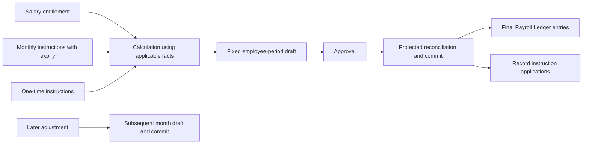
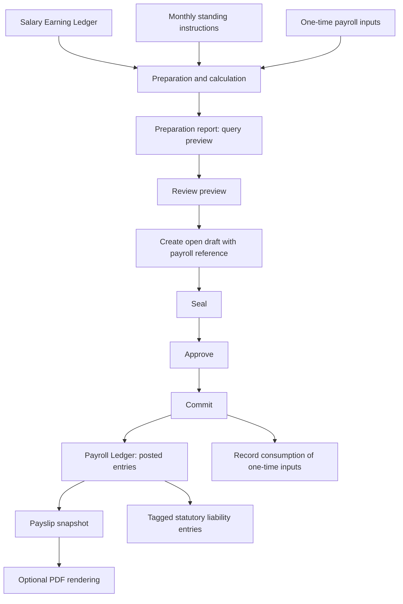

# Payroll core concepts — existing model for confirmation

This is the starting chapter for the [handbook](handbook.md), following the
user's direction to begin with the concepts already expressed in code and
confirm and refine the model that produces the flow.

Source: lab revision `737465d5e27888518018e9b1f28f75fcfcac0139`,
[main.ts](../src/main.ts), including its types, state stores, operations, and UI
labels. The descriptions below reconstruct the existing model. Refinement
candidates are identified separately; they have not been adopted or implemented.

Current source clarification (PAY-SOURCE-001): the user describes source records
as immutable, with old records expired and replacements created. The
[agreed reconciliation model](source-reconciliation.md) uses this history with
fixed drafts and protected validation at commit, replacing the long-lived
source freeze. This clarification
does not prove that every source lifecycle is implemented in the lab.

## Agreed core model

This section consolidates existing agreements; it introduces no new rule.

1. Salary earnings supply entitlement. Monthly and one-time instructions supply
   payroll directions. The producing layer determines business intent; payroll
   does not infer overlap or duplicates across separate sources.
2. Calculation uses the applicable facts for the payroll period when it runs.
   Business formulas belong to calculation logic; payroll core governs records
   and their lifecycle. Mandatory tracing back to input origins is out of scope.
3. Calculation produces a complete fixed draft for an employee and payroll
   period. Previewing is not posting. A batch coordinates exact employee drafts
   and retains individual outcomes.
4. The approved draft is reconciled against the applicable basis at protected
   commit. Relevant changes require rebuilding and fresh review. Source
   maintenance continues during review; there is no day-long source freeze.
5. Commit records the monetary entries and instruction applications together.
   One-time instructions are consumed then. A monthly instruction has one
   ordinary application per applicable month until expiry; expiry is evaluated
   against the payroll period.
6. Generated/committed payroll is final and as good as paid for the core. A
   correction is an adjustment in a subsequent payroll month; the original
   result stays unchanged.



Example: September salary entitlement contributes INR 50,000, a monthly
allowance contributes INR 1,500, a one-time bonus contributes INR 5,000, and a
monthly deduction contributes INR -1,000. The draft and committed result have
INR 56,500 gross, INR 1,000 deductions, and INR 55,500 net. The bonus is consumed;
the standing instructions can apply in later eligible months. If the bonus
requires INR 500 recovery, September remains fixed and a subsequent month's
payroll includes that adjustment.

The [coverage checkpoint](core-coverage.md) preserves the user's scope
clarifications and their rationale. Code findings below remain evidence; source
references, demo formulas, and mutable open-draft operations are not silently
adopted requirements. Known implementation gaps remain separate from conceptual
agreement. The [output boundary](payroll-outputs.md) now records the user clarification:
employer liabilities are inside payroll; general accounting is outside.

The five stores describe employee payroll. The employer-liability register is
also part of payroll under PAY-ARCH-004; it records employer obligations rather
than adding another source type to employee salary calculation.

## The five central stores

| Concept | Meaning in this model | Code representation |
|---|---|---|
| Salary Earning Ledger | Employee salary entitlement broken into earning components, with owner, effective date, source, and reference. These are sources for preparing payroll. | `SalaryEntry`, `state.salary`, `appendSalary` |
| Monthly standing-instruction ledger | Recurring payroll directions with an effective lifetime and expiry (agreed in PAY-CORE-002). The demo includes both a monthly allowance and recurring deductions, but does not enforce expiry. | `PayrollInputEntry` with `monthly_standing`, `state.standingInputs` |
| One-time payroll-input ledger | Inputs intended for a specific period and a single application, such as a bonus or recovery. Posting records the consuming payroll reference. | `PayrollInputEntry` with `one_time`, `state.oneTimeInputs`, `consumedBy` |
| Draft transaction ledger | Complete proposed payroll entries, fixed from creation and reconciled before commit under PAY-CORE-006-C. The inspected lab still permits appends while open; that is a recorded implementation gap. | `Draft`, `DraftEntry`, `state.drafts` |
| Payroll Ledger | Committed earning and deduction entries, retaining their draft, payroll reference, owner, date, and source links. | `PostedEntry`, `state.posted` |

Monthly and one-time classify an input's recurrence. Earning and deduction
classify the resulting monetary component. These are different dimensions:
monthly instructions can add an allowance or deduct VPF; one-time inputs can
add a bonus or deduct an amount. There is no separate posted monthly ledger
and posted one-time ledger in this implementation: both contribute entries to
the Payroll Ledger through a draft.

The Salary Earning Ledger is distinct from an earning entry posted for a
particular payroll period. The former supplies entitlement; the latter records
the amount actually committed for that payroll reference. Whether salary and
recurring instructions should share more underlying semantics is a later
refinement question, not a reason to merge them silently now.

## PAY-CORE-001 — draft and posted payroll boundary

**Status: agreed under PAY-Q-003.** The user answered "approved". This makes the existing
distinction explicit; it does not finalize every draft operation or correction
rule.

The **Payroll Ledger** records committed payroll monetary results: earning and
deduction entries associated with an owner, payroll reference, and date. The lab
entries retain source links, but PAY-CORE-010 removes these as a core requirement. Gross,
deductions, and net are summaries of those entries; the ledger holds the
components rather than just one net amount.

The **draft ledger** holds the proposed entries before they are committed.
It gives the system a concrete set of amounts to inspect and approve. Its
monetary proposal is distinct from the source entitlement and instructions
that produced it. In the current code, new entries can be appended while the
draft is open. The current PAY-CORE-006-C decision retains fixed monetary content
from complete creation, with cancellation and rebuilding for corrections;
the appendable open draft is an implementation gap.

The agreed boundary is that committing establishes the recorded result.
Later source changes do not rewrite that committed result. A subsequent
correction is represented by linked additional entries, retaining the earlier
record. PAY-CORE-011 establishes that generated/committed payroll is as good
as paid for core finality: corrections belong in a subsequent payroll month.
The earlier result is not reopened based on external payment status. A preview
or uncommitted draft remains a proposal.

### PAY-EX-003 — one result across the boundary

Illustrative amounts, chosen to isolate the ledger concepts:

| Proposed row | Source | Amount (INR) |
|---|---|---:|
| Salary earning | Salary Earning Ledger | 50,000.00 |
| Monthly allowance | Monthly instruction | 1,500.00 |
| Bonus | One-time instruction | 5,000.00 |
| Monthly deduction | Monthly instruction | -1,000.00 |

The proposed gross is INR 56,500.00, deductions INR 1,000.00, and net
INR 55,500.00. Preparation can display these values, but it is creating the
draft that gives the proposed payroll transaction its reference and entries.
Until commit, these draft rows are not posted Payroll Ledger entries.

Commit posts those four rows under the draft's payroll reference. A payslip
snapshot can then identify the committed result. The source ledgers remain:
salary entitlement is not erased, the monthly instructions remain available,
and the one-time instruction gains its consumption linkage.

If the bonus is later found to be INR 500.00 too high, the agreed model keeps
the original INR 5,000.00 bonus entry and records a linked INR 500.00 recovery.
Under PAY-CORE-011 the recovery belongs to a subsequent payroll month: for
example, September keeps the bonus and October includes the recovery through
its governed draft/commit flow.

Counterexample: changing the original committed bonus to INR 4,500.00 and
silently regenerating its historical payslip would erase the original result.
Likewise, abandoning a draft must not be described as reversing posted money:
the proposed rows had not crossed the commit boundary.

### Why keep this distinction

Source records answer what can contribute to payroll. Draft rows answer what
we propose to record for this payroll reference. Posted rows answer what was
committed. A live report over today's salary and instruction records cannot by
itself preserve yesterday's committed result when those sources change.

The current `commitDraft` copies approved rows into posted state and retains
their draft and source linkage. The correction demo preserves original rows.
These support the agreed boundary, while the in-memory storage, weak
checksums, and correction shortcut remain implementation limitations.

**PAY-Q-003 — approved:** The draft holds proposed payroll
entries; commit fixes the recorded result; later corrections add linked entries
without rewriting the original result.

The approval settles this boundary; PAY-CORE-011 further settles subsequent-month
correction timing and finality. Exact enforcement remains open. The demo's
direct-posting correction shortcut is not an adopted bypass.

## PAY-CORE-002 — salary earnings and monthly instructions

**Status: agreed with expiry amendment under PAY-Q-004.** The user approved the
source distinction and required standing instructions to accommodate expiry,
using a loan repaid over five months as the example. Rationale is preserved
below as explicitly requested.

Both sources can contribute an earning repeatedly. Recurrence alone therefore
does not explain why the model has both a Salary Earning Ledger and monthly
standing instructions. The agreed distinction is their meaning:

- The **Salary Earning Ledger** records the employee's salary earning
  entitlement, broken into components and carrying an effective date.
- **Monthly standing instructions** record recurring directions to payroll,
  which can produce additional earnings or deductions during their effective
  lifetime, with expiry governing when they cease to apply.

This follows the existing source separation. `appendSalary` accepts an earning
head and stores salary entries. `appendPayrollInput` stores monthly directions
separately. The example places basic, HRA, and special allowance in salary;
internet allowance, VPF, and a tax instruction are recurring inputs. Those
sample placements do not establish that every allowance belongs in one store
or that a tax amount must always be a standing instruction.

### PAY-EX-004 — recurrence is shared, purpose differs

Suppose salary entitlement is INR 50,000 per month, and a monthly instruction
adds INR 1,500 for an allowance. Both contribute earnings to preparation, but
they preserve different source meanings. A recurring deduction of INR 1,000
can also be an instruction; it is not a salary earning entry.

Changing salary entitlement and changing a recurring instruction are therefore
different source changes even if both affect next month's calculated amount.
Neither change rewrites a result already committed under PAY-CORE-001.

Counterexample to recurrence as the definition: putting all repeating amounts
in salary would also place recurring deductions in an earning-only source.
The opposite approach—treating salary as just another monthly instruction—would
merge a distinction the current model makes explicitly. That is an alternative
to discuss, not an implementation change to make silently.

One unresolved overlap deserves attention: if the same allowance appears in
salary and as a monthly instruction, recurrence or head name alone cannot tell
whether the second amount is intentional additional money or a duplicate.
The later PAY-CORE-008 clarification places detection and resolution of this
business intent in the producing layer. Payroll core does not infer it from
head names or recurrence. The demo has no general resolution rule.

### PAY-EX-005 — a standing instruction that expires

The user's example is a loan repaid over five months. For illustration, assume
the agreed recovery schedule is INR 2,000 in each of five monthly payrolls.
Payroll accommodates this through a recurring deduction instruction with an
expiry boundary. It must not continue contributing deductions beyond its
applicable lifetime merely because it is a standing instruction.

The loan is the business reason for the instruction. Loan origination,
interest calculation, and servicing are not adopted as payroll core concepts.
The core needs to express and respect the instruction's lifetime; higher-order
business logic can determine the repayment schedule that it represents.

This example assumes the five scheduled applications occur normally. A
five-calendar-month window and five successful deductions can diverge when a
payroll is skipped. The user has not selected a representation or catch-up rule
for that case. Expiry is agreed; end-date encoding, installment-count semantics,
boundary inclusivity, early cessation, and extension rules remain open.

### Rationale and consequences of expiry

Recurrence means an instruction can apply repeatedly; it does not mean the
underlying obligation lasts forever. The five-month loan example demonstrates
why a finite instruction must be expressible without changing salary earning
entitlement or building loan-specific behavior into the payroll ledger.

Keeping the recurring instruction separate also preserves the reason for the
deduction. A temporary recovery does not become a permanent reduction of the
employee's salary entitlement. At expiry, it stops contributing new ordinary
payroll entries for periods outside its lifetime. Entries already committed
remain recorded under PAY-CORE-001.

Counterexample: continuing a five-month repayment instruction into a sixth
applicable month solely because it remains stored would apply it beyond its
agreed lifetime. Another counterexample is removing the instruction's historical
effects from posted payroll when it expires; expiry limits applicability, not
the existence of the historical record.

The original proposal explained recurrence but did not explicitly cover expiry.
The user's amendment supplies this requirement. In the inspected code,
`effectiveUntil` exists as optional metadata, but `appendPayrollInput` does not
populate it and `preparePayrollReport` does not evaluate it. This is tracked as
[PAY-GAP-001](implementation-gaps.md#pay-gap-001--standing-instruction-expiry).

**PAY-Q-004 — approved with expiry amendment.** Source purpose and expiry are
settled at concept level. Overlap, replacement, and exact lifetime mechanics
remain dependent questions.

## PAY-CORE-003 — when a one-time instruction is consumed

**Status: agreed under PAY-Q-005.** The user approved after the one-time bonus
example was explained again. The agreed expiry requirement applies to
standing instructions. A one-time instruction has a different limit: a single
application, within whatever period rules are ultimately agreed.

Agreed rule: preparing, reviewing, or drafting an instruction does not consume
it. Consumption occurs when the payroll entries applying it are committed, and
is linked to that committed payroll reference. Abandoning an uncommitted draft
leaves the instruction available. Another ordinary payroll must not apply the
same consumed instruction again.

Rationale: a preview or abandoned proposal creates no committed payroll effect.
Consuming there could lose a bonus without recording it in payroll. Allowing
another ordinary commit to reuse the same instruction could instead duplicate
that effect.

Example: a one-time bonus appears in a draft that is abandoned. It remains
available for a replacement draft. Committing the replacement applies the
bonus once and records its consumption. Returning an acknowledgement for a
retry of that same commit must not create another application.

Consumption means the instruction's effect has entered committed payroll;
PAY-CORE-011 treats that committed payroll as paid for core finality. The
instruction is retained with its
consumption reference, rather than erased as if it had never existed.

The demo marks `consumedBy` in `commitDraft`, which supports the agreed timing,
but it does not generally prevent another draft from using that source again.
That missing enforcement is tracked as [PAY-GAP-002](implementation-gaps.md#pay-gap-002--one-time-consumption-across-drafts).
This decision does not settle partial application, reservation during drafting,
or whether a later linked reversal changes an instruction's availability.

**PAY-Q-005 — approved:** One-time instructions are consumed only on commit,
remain available after an abandoned draft, and are unavailable for another
ordinary payroll once consumed.

Return points: standing-instruction expiry mechanics; salary/instruction
overlap and replacement; correction effects on consumed inputs.

## PAY-CORE-004 — monthly application versus instruction lifetime

**Status: agreed under PAY-Q-006.** The user answered "approved".
PAY-CORE-002 settles expiry and PAY-CORE-003 settles one-time consumption.
This decision addresses how a monthly
instruction repeats without duplicating its effect within the same month.

Agreed rule: a monthly standing instruction may have one ordinary committed
application for an employee in each applicable payroll month. Committing that
month's application does not exhaust the instruction for its entire lifetime;
it can apply in the next eligible month until expiry. Preparation and abandoned
drafts do not count as committed applications.

Illustrative example: a monthly loan-recovery instruction contributes INR 2,000
to September payroll. A later ordinary payroll for the same employee and
September must not deduct that same monthly instruction again. October can
apply it if October remains within its lifetime. Linked corrections require
their own treatment and are not ordinary repeat applications.

Rationale: monthly recurrence authorizes repetition across eligible months,
not repetition every time payroll is prepared or another run is created for
the same month. Treating it as permanently consumed after September would lose
October's intended recovery; treating it as unrestrictedly reusable would allow
duplicate September deductions.

The conceptual record is that this instruction has already been applied for
this employee and month, with a link to the committed result. This does not
prescribe a new table, field name, or locking strategy. It also does not decide
how changed instruction versions, split applications, skipped months, or
corrections affect that record.

The current lab marks one-time consumption but has no general monthly
application check in `commitDraft`. Its single guided preparation does not
establish the agreed rule for multiple payrolls. This is tracked as
[PAY-GAP-003](implementation-gaps.md#pay-gap-003--monthly-application-across-drafts).

**PAY-Q-006 — approved:** A monthly standing instruction has one ordinary
committed application per employee and applicable payroll month. Commit records
that month's application while leaving later eligible months available until
expiry.

Return points remain expiry representation and skipped-month behavior, source
overlap/replacement, and correction effects on instruction applications.

## PAY-CORE-005 — applicability period and processing time

**Status: agreed under PAY-Q-007.** The user answered "approved".
This decision distinguishes the payroll
month an instruction can affect from the date on which payroll is prepared or
committed.

Agreed rule: evaluate a standing instruction's effective lifetime against the
payroll period being processed. Expiry excludes later payroll periods; it does
not by itself invalidate an eligible earlier period because processing happens
later. Period-specific application checks from PAY-CORE-004 still apply.

Illustrative example: a five-month deduction instruction covers September
through January. January payroll is prepared and committed in February. It
can still include the January application, provided it has not already been
committed and all other applicable controls permit the operation. February
payroll cannot acquire an ordinary February application from that instruction.

Rationale: an instruction describes when its payroll effect applies. A delay
in executing the same period's payroll should not by itself change which
source directions contribute. Separating applicability from processing time
also preserves a consistent explanation of later processing of earlier periods.

Counterexample to this rule: excluding January's instruction solely because
the current date is in February would turn a processing delay into a different
January result. Conversely, processing February payroll early in January must
not make an instruction applicable to February merely because it has not yet
expired by the current date.

This is not authorization to reopen a closed period, duplicate a committed
application, or change an approved result. Those operations retain their own
rules. It does not automatically move a missed installment into February,
extend expiry until five deductions succeed, or settle early termination and
instruction-version history. Date versus installment-count expiry, exact
boundary encoding, catch-up policy, and correction mechanics remain open.

The existing code already distinguishes source effective fields from a draft's
period and ledger date, but its fixed demo selection does not implement this
agreed applicability evaluation. PAY-GAP-001 records the expiry gap and now
includes the agreed time basis in its required closure evidence.

**PAY-Q-007 — approved:** Expiry is evaluated against the payroll period being
processed. A still-unapplied eligible earlier period may be processed later,
subject to the other payroll controls.

Return points: expiry representation and skipped-month recovery; source
overlap/replacement; changes to source instructions; correction behavior.

## PAY-CORE-006 — source changes and an existing draft

**Status: superseded by approved PAY-CORE-006-B under PAY-Q-008.** The user
approved freezing relevant sources and draft monetary entries from creation
through commit or cancellation. The
[agreed source-freeze chapter](draft-source-freeze.md) records that shape and
its rationale. The original proposal below is preserved as superseded history.
The later [PAY-CORE-006-C reconciliation model](source-reconciliation.md)
is now approved and supersedes the long-lived source freeze as well.
PAY-CORE-001 fixes committed results; this earlier proposal concerns mutable
sources and an already-created draft.

Proposed rule: a created draft holds an explicit set of proposed payroll values.
A change to salary earnings or an instruction does not silently change those
values. Incorporating changed sources requires an explicit recalculation and
draft update or replacement. Approval of the earlier values does not approve
the changed values; a revised result needs its own approval before commit.
The exact revision, replacement, and reopening operations remain to be defined.

Example: a draft contains a one-time bonus of INR 5,000. The source instruction
is then corrected to INR 6,000. The existing draft still shows its INR 5,000
proposal. To include INR 6,000, explicitly produce a revised proposal. If the
earlier proposal was approved, that approval cannot silently carry over to the
revised amounts.

Rationale: the draft is a concrete object people can inspect and approve.
If it continuously follows mutable sources, someone could inspect one set of
amounts and later commit another without an explicit change to the proposal.
Keeping the change explicit preserves what was reviewed and why the result
changed. It also maintains the distinction between preparing a fresh query
result and holding a particular draft transaction.

Counterexample: a background source update changes the approved draft bonus to
INR 6,000 while leaving its approval untouched. The approval would no longer
identify the values being committed. Another counterexample is hiding the
source change entirely and implying that a retained draft must therefore still
be eligible to commit: retaining values and validating their current authority
are different requirements.

This proposal does not authorize committing stale, revoked, or otherwise
ineligible inputs. Whether a source change blocks commit or merely requires
explicit review, how source versions are preserved, and how sealed or approved
drafts are superseded remain open. PAY-CORE-003 and PAY-CORE-004 continue to
govern consumption at commit; recalculation alone does not consume an input.

Source evidence: `fireDraftPayroll` copies preview values into new draft rows;
`appendDraft` requires open status; seal and approval are separate operations.
The code does not implement a general draft revision or source-change
invalidation workflow. Its existing value-copying behavior supports the
starting distinction without proving all of this proposed rule.

**PAY-Q-008:** Should source changes leave an existing draft's values unchanged
until an explicit revision or replacement, with earlier approval not carrying
over to changed values?

Return points: source-version evidence and commit freshness, revision/reopening
mechanics, source overlap/replacement, expiry representation, skipped-period
recovery, and corrections.

## How the stores produce the flow

The diagram below records the inspected lab implementation. The
[current agreed lifecycle](source-reconciliation.md#agreed-flow) requires a
complete fixed draft over immutable sources, followed by protected reconciliation
at commit. Relevant changes block commit and require rebuilding and fresh review.
The earlier long-lived source freeze is superseded. Separate sealing remains
parked under PAY-Q-009 during the horizontal pass.



`preparePayrollReport` is explicitly higher-order demo code: it reads sources,
applies demo calculation logic, and constructs a preview. The ledger operations
store and transition entries. The formula that derives a particular deduction
is therefore separable from the operation that appends its monetary result.
Here, higher-order describes responsibility; all code is in one browser file,
so it does not imply a deployed external service.

`PreparationReport` has a query ID and checksum, but no `LedgerReference`.
Reviewing it changes local preview state. `fireDraftPayroll` creates a payroll
reference and draft, copies the preview rows, and compares the checksums. This
is the creation of a proposed payroll transaction; salary and instruction
source records already existed before it.

The inspected lab's draft lifecycle is:

```text
open → sealed → approved → committed
  └────────────→ abandoned
         sealed → abandoned
```

The code permits abandonment from open or sealed, but not approved or committed.
Sealing requires at least one row. Appending requires open status. Committing
requires approved status; repeating commit on the same committed draft returns
without reposting it. Revision starts at 1; a general draft revision workflow
is not implemented by these functions.

The draft and its posted rows share the same payroll reference. Commit adds
posted-entry identifiers and retains source and draft lineage. It does not
create a second unrelated payroll business reference or delete the draft.

## Supporting concepts that hold the model together

**Component/head.** `Head` defines a named earning or deduction such as basic,
bonus, or VPF. Entries refer to its key. The demo producer supplies positive
earning amounts and negative deduction amounts. `totals` uses head kind and
the signed values to calculate gross, deductions, and net. An `effect` field
also exists, but it does not drive that totals function.

**Owner, date, and period.** Source and transaction records identify whose
ledger they belong to and carry dates. Effective dates describe source
applicability; payroll periods describe the calculation month; ledger dates
date the resulting entries. The demo fixes many source dates and uses month-end
for ordinary drafts. Those fixed dates are sample choices, not general rules.

**Reference and provenance.** Salary, input, payroll, and correction references
organize records and carry status, owner, date, and period. Payroll rows retain
`sourceReference`; corrections retain links to the original reference and
posted entry. An entry ID, a payroll reference, and a source reference serve
different tracing purposes.

**Proof attachment.** A file is supporting evidence. In the demo, simulated HR
review creates a monetary instruction that links to the attachment. The file
itself is not an entry in the monetary ledgers.

**Payslip snapshot.** Commit captures the posted entry IDs, totals, and a hash
under the payroll reference. The PDF renders that snapshot. The concept is an
identifiable result tied to committed money, rather than an independently
editable document defining payroll amounts.

**Correction.** The demo preserves the original posted rows and adds a linked
recovery under a later reference. Its shortcut writes directly to posted state;
PAY-CORE-011 requires an adjustment in a subsequent payroll month through the
governed payroll flow. The shortcut does not enforce that full behavior.

**Liabilities and reconciliation.** Tagged posted deductions produce liability
credits owned by the demo legal entity. Simulated authority settlements produce
debits; match records associate credits and debits. Annual certificate readiness
uses downstream records and explicitly remains incomplete in the demo. These
extend the core flow without changing the distinction between input, draft, and
posted payroll.

## Worked trace through the concepts

In the existing example, salary entries contribute INR 80,000; a monthly
allowance adds INR 1,500 and a one-time bonus adds INR 5,000. Monthly deductions,
a one-time leave deduction, and the demo PF calculation total INR 13,500.
Preparation shows gross INR 86,500 and net INR 73,000.

Those preview amounts become draft entries, then posted entries after seal,
approval, and commit. The one-time inputs receive the consuming reference;
monthly inputs remain stored for reuse. The detailed figures and source
limitations are in [PAY-EX-001](operating-baseline.md#pay-ex-001--numbers-in-the-guided-example).

## Implementation details and retained alternatives

The original refinement checklist is resolved or narrowed by later decisions:

| Earlier candidate | Current disposition |
|---|---|
| Source applicability and reuse | PAY-CORE-002 through 005 establish expiry and application rules; PAY-CORE-009 uses applicable facts. Exact representation remains open; PAY-GAP-001/002/003 track enforcement. |
| Source-to-draft lineage | PAY-CORE-010 removes mandatory source tracing. PAY-CORE-006-C still requires validation of the applicable basis; validation representation remains open. |
| Draft change lifecycle | PAY-CORE-006-C establishes a fixed draft and cancel/rebuild/fresh review on relevant changes. PAY-GAP-005 tracks implementation; separate sealing is parked under PAY-Q-009. |
| Corrections | PAY-CORE-011 establishes finality and subsequent-month adjustments. PAY-GAP-006 records the direct-posting/date-enforcement shortcut. |
| Amount representation | Head kinds and producer-supplied signs describe current code. Exact encoding and rounding choices remain implementation/calculation topics, not mandatory source-provenance work. |

The superseded freeze/revision alternatives earlier in this chapter are history.
The [decision log](decision-log.md) and [roadmap](handbook-roadmap.md) identify
current agreements and remaining discussion; they should not reopen settled
concepts merely because the demo does not enforce them.
