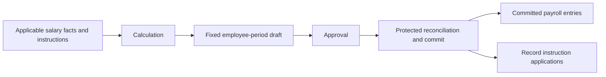

# Core-concept coverage checkpoint

Status: updated after the user's direct clarifications, PAY-CORE-008/009/010/011.
The previous four-gap checklist was too broad. Its rejected assumptions are
preserved below rather than retained as prerequisites for core clarity.

## Established model

| Concept | Meaning |
|---|---|
| Salary Earning Ledger | Salary entitlement components supplied to payroll. |
| Monthly instructions | Recurring earning/deduction directions with expiry. |
| One-time instructions | Single-application directions consumed on payroll commit. |
| Draft ledger | Fixed employee-period monetary proposal. |
| Payroll Ledger | Committed monetary entries; later corrections preserve the original. |

The lab types, preparation, draft/commit, references, totals, and correction
example were reviewed at `737465d5e27888518018e9b1f28f75fcfcac0139` in
[main.ts](../src/main.ts). Reviewed code is not deployed-system verification or
proof of conformance. The [core chapter](core-concepts.md) records the evidence.

## User clarifications and rationale

**PAY-CORE-008 — source business overlap belongs to another layer.** The user
said payroll cannot and should not detect whether overlapping sources express
additional money, a replacement, or a business duplicate. The producing layer
must supply the intended facts/instructions. A shared head or equal amount is
not a core reason to deduplicate, override, or reject them. This is distinct
from the already agreed prevention of repeated application of the same
one-time or monthly instruction.

**PAY-CORE-009 — use the reality/facts when payroll runs.** The user said what
matters is the reality/fact when running payroll. Use the then-applicable facts
for the target payroll period. Do not turn reconstruction of business intent
across old and new records into a prerequisite for running payroll. Existing
expiry-by-payroll-period, application, fixed-draft, and reconciliation decisions
remain recorded. This clarification does not by itself authorize duplicate
applications or changing the reviewed draft's amounts at commit.

**PAY-CORE-010 — source tracing is not a core requirement.** The user said
"we dont even need to trace the source". A monetary entry does not need a
mandatory causal link to every input or external origin. Source-reference
fields in the demo are implementation evidence, not a requirement to reproduce
that design. Earlier mandatory provenance wording is superseded to this extent.

Reconciliation still checks whether the applicable basis changed before commit;
instruction application still follows the agreed rules. Those controls do not
require a business provenance graph for each monetary entry. Their concrete
validation mechanism remains open; no source-reference schema is imposed here.

## PAY-CORE-011 — generated payroll is final; adjust a subsequent month

**User-confirmed rule.** The user clarified that this was already explained:
"we should adjust it in subsequent month, once payroll is generated its as good
as paid". This settles the correction timing and finality question.

In the established draft/commit vocabulary, generated payroll here is the
committed payroll result. A calculation preview or uncommitted draft remains a
proposal. Once committed, treat that payroll as paid for core finality: preserve
that month's result and carry any correction into a subsequent payroll month.
An external payment status does not provide a reason to reopen that result.
This is the payroll-core convention; it does not assert a bank-confirmation event
or introduce one as a prerequisite for finality.

Example: September payroll includes a committed INR 5,000 bonus. A later
correction requires INR 500 recovery. September stays at INR 5,000; October
payroll includes an INR -500 adjustment if that is the subsequent payroll being
processed. The combined effect across both months is INR 4,500. The producing
layer determines the adjustment; payroll need not infer the business mistake.

The adjustment passes through the subsequent month's governed draft and commit
flow under PAY-ARCH-001. It does not undo the earlier commit or automatically
restore a consumed instruction. No source-provenance requirement is added.

Rationale: treating generation as final gives payroll one stable completion
boundary. A later correction changes a subsequent month's payroll rather than
changing the meaning of a previously generated result. The user's clarification
closes the earlier correction explanation; it should not be reintroduced as an
unanswered foundational question.

The demo's `carryAdjustmentToNextMonth` preserves the original and illustrates
September-to-October recovery. It directly posts and does not enforce that the
provided date is in a later month, so it only partially demonstrates the agreed
behavior. These are implementation gaps, not reasons to reopen the concept.

## Current flow and return point

The four-item checkpoint is resolved at the intended concept level by
PAY-CORE-008/009/010/011. Do not restart the rejected overlap-detection and
mandatory-source-tracing questions or ask again when corrections apply.
The [agreed core model](core-concepts.md#agreed-core-model) is now consolidated.
The user instructed us to proceed; the next horizontal proposal is
[committed payroll and downstream records](payroll-outputs.md). Detailed role
and integration mechanics remain parked.

## Earlier checklist and its disposition

1. Source composition/duplicate detection: removed as a core responsibility by
   PAY-CORE-008; the producing layer owns business intent.
2. Cross-version intent reconstruction: narrowed by PAY-CORE-009 to applicable
   facts at run time; existing application rules remain in effect.
3. Mandatory source-to-result lineage: rejected by PAY-CORE-010. Basic component
   and amount representation can be discussed without imposing provenance.
4. Correction timing/finality: settled by PAY-CORE-011. Generated/committed
   payroll is treated as paid; corrections affect a subsequent payroll month.

The five-store model is established. Open implementation choices and optional
features must not be presented as missing foundational concepts. No complete
implementation conformance is claimed.
