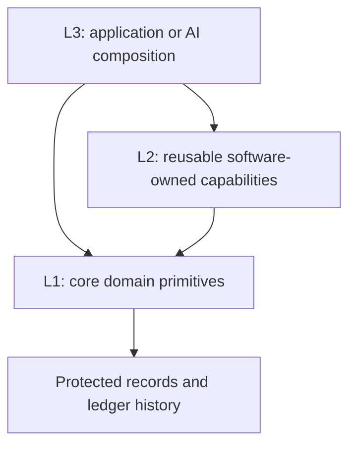

# 123 Architecture

**Lab design pin, 2026-09-08.** Retained here at the user's request. Read the [design index](README.md) for status and ownership. This is readable design content, not a forwarding page.

Initial pin reconciled with [Core source at `b72312a`](https://github.com/agentlabs-poc/agentlabs-hrms-core/blob/b72312a8203a37ab97669f760099516a2bba1d9d/docs/payroll/handbook/primitive-layers.md). Acceptance and proposal labels below remain in force; the browser lab and production schema are unchanged.

**Pinned by the user on 2026-09-08.** The user defined Layer 1 as core primitives,
Layer 2 as auxiliary but still software-owned primitives, and Layer 3 as the
application or AI-owned layer above them. After reviewing the refinements below,
the user directed: “pin it. and lets move to group 3”.
The user subsequently named this model **123 Architecture**.

## Current layer definitions

| Layer | Contract and ownership | Payroll examples |
|---|---|---|
| L1: core primitives | Fundamental domain records, valid operations and integrity guarantees | Salary earning ledger, instructions, fixed employee draft, exact employee commit, Payroll Ledger, employer-liability register |
| L2: auxiliary primitives | Reusable, software-owned capabilities and auxiliary records built using L1 | Versioned compensation packages, reusable earning listings, package application, aggregate projections and coordination across employees |
| L3: application composition | Task-specific intent, choices, sequencing, interactions and exception handling; may be AI-owned | Select a fresher package, gather inputs, choose employees, prepare their payroll and resolve outstanding cases |

These are logical boundaries, not a requirement for separate repositories,
services, network hops or a particular programming language. Classify an API by
the contract and records it owns. Who authored its code does not determine its
layer: an AI-assisted implementation adopted into the maintained software
contract remains software-owned.

## Composition and guarantees

1. **Domain operations are the L1 unit.** Committing one employee's fixed draft
   may atomically create several ledger and instruction-application records.
   The no-bulk-write rule prevents cross-employee orchestration in L1; it does
   not split one employee commit into independent row writes.
2. **L2 may own auxiliary state.** A reusable compensation package belongs to
   L2; employee earning entitlements created from it belong to L1. L2 uses the
   supported L1 boundary to change core records.
3. **L3 may use L1 or L2.** Standard cases can use a maintained composition;
   unusual cases can assemble authorized core operations directly. L2 is not a
   mandatory gateway, and neither path bypasses core guarantees.
4. **AI owns the composition, not the facts of execution.** Operation results
   and stored records establish what happened. A workflow cannot report a held
   or failed employee as committed. Coordinating many employees preserves
   individual outcomes and the atomicity each underlying primitive provides.
5. **Useful compositions can become auxiliary primitives.** A task-specific L3
   composition may become a reviewed, tested, versioned L2 capability when
   demonstrated reuse justifies maintaining it. This is not automatic promotion
   of generated code or a reason to build hypothetical workflows in advance.
6. **Contracts must support reliable composition.** Expose understandable
   inputs, scope, effects, prerequisites, results and retry behavior. Software
   enforces the contract; tool descriptions do not substitute for enforcement.

## Canonical concepts before endpoint contracts

**Pinned by the user on 2026-09-08.** The user stated “anything comming in
endpoint uri should be canonical”, then directed that this principle be pinned.

Every domain resource and operation named in an endpoint URI must have an
approved canonical meaning in the handbook. Define its meaning, scope, identity
and applicable lifecycle/integrity rules before accepting the public contract.
Existing tables, internal types, handler names and historical API routes are
implementation evidence; they do not establish canonical domain concepts.

Review in this order:

**Canonical concept → canonical operation → layer placement → endpoint.**

This applies to all layers' public domain APIs. An L2 auxiliary capability can
have a canonical definition without becoming an L1 primitive. An endpoint's
record scope alone does not establish either its layer or its conformance.
Likewise, approving a broad domain concept does not automatically approve every
existing URI, lifecycle action or request schema associated with it.

For instructions, the handbook defines standing/monthly instructions, one-time
instructions and committed application evidence. The existing
`instruction-versions` resource and its approval/activation lifecycle still need
reconciliation against those meanings. Their presence in code does not settle
that review. No Group 3 retention or deprecation decision has been approved.

Rationale: stable domain vocabulary lets software and AI compose the same
well-defined capabilities. Deriving public concepts from implementation details
would make the handbook follow accidental API shape instead of governing it.
Canonical identity meaning does not prescribe an ID-generation algorithm; the
earlier employee-month association agreement remains intact.

**Table-mapping rule, pinned 2026-09-08:** the user directed that anything not
mapping to the canonical ledgers be deprecated, and requested canonical tables
listed first by layer. The [table register](canonical-ledger-tables.md) maps
current physical storage to L1 ledger/supporting responsibilities, identifies
the absence of accepted L2/L3 table designs, then lists deprecated structures.
A supporting table needs a concrete ledger-integrity or output role; merely
being used by payroll is insufficient. This is a design disposition, not
authorization to drop tables or rewrite stored records.

The user subsequently designated the nine tables in the register's primary L1
ledger list as **canonical L1 ledger tables**. Supporting tables remain separately
classified; no salary-ledger table name was invented to fill the existing gap.
Canonical designation confirms their names and ledger roles, while current API,
lifecycle and schema-dependency conformance still requires verification.

## Worked example and rationale

The subsequent [canonical supporting-record direction](payroll-records.md)
targets one reusable four-column JSON table for the current supporting roles.
The user refined its scope to one such table per domain, with payroll owning
its supporting-record table. Shared shape does not imply shared domain authority.
Canonical terms, versioned schemas, queries/indexes and integrity rules govern
its entries. Shared storage does not change layer ownership or introduce generic
mutation authority. Client validation/composition can use the same contracts;
authoritative validation and atomic ledger operations remain in L1.

L2 stores a versioned fresher compensation package listing Basic Salary of
INR 30,000/month and HRA of INR 10,000/month. L3 selects the package, employee
and effective date. Applying the package invokes L1 salary-earning operations;
the resulting employee entitlements and their history are core records. Payroll
preparation and commit subsequently use those applicable records under the
chosen policy. The amounts illustrate composition, not an employer pay rule.

The stable investment is a coherent core domain contract plus useful maintained
auxiliary capabilities. Applications and AI can vary the composition without
reimplementing ledger integrity. This avoids both forcing every workflow into
core and making AI reconstruct every common operation from scratch.

## Earlier vocabulary and implementation status

PAY-ARCH-006 and earlier handbook chapters used “Layer 2” to mean the layer above
core, particularly organizational policy. This pinned definition refines that
vocabulary: reusable software-owned policy capabilities can be L2, while their
task-specific selection and orchestration can be L3. Their original boundary
remains: organizational choices do not become universal L1 rules.

Existing [run](https://github.com/agentlabs-poc/agentlabs-hrms-core/blob/b72312a8203a37ab97669f760099516a2bba1d9d/docs/payroll/run-api-deprecation.md) and
[compensation-plan](https://github.com/agentlabs-poc/agentlabs-hrms-core/blob/b72312a8203a37ab97669f760099516a2bba1d9d/docs/payroll/compensation-api-deprecation.md) API deprecations remain
in force. Those capabilities may have an L2 home, but current implementations
are not reclassified or reinstated merely by renaming their layer. Verify that
they compose the core contract first. This decision pins architecture; it makes
no runtime, API, CLI, database or deployment change. The ongoing API group review
and implementation conformance remain separate work.
