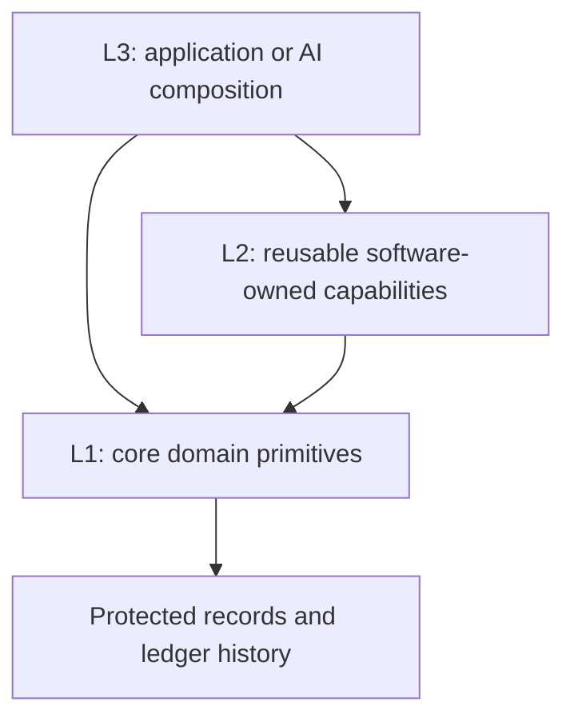

# 123 Architecture

**123: a new software-design paradigm for AI-native applications.** The user
requested this framing on 2026-09-08. It names the model being defined here:
canonical domain primitives, domain/layer-owned persistence and software/AI
composition through explicit contracts. “New” describes this proposed synthesis;
it is not a claim that its individual ingredients were invented here or that
unprecedented originality has been established. The architecture name remains
**123 Architecture**, also referred to as the **123 Software Design Paradigm**.

**Lab design pin, 2026-09-08.** Retained here at the user's request. Read the [design index](README.md) for status and ownership. This is readable design content, not a forwarding page.

Initial pin reconciled with [Core source at `b72312a`](https://github.com/agentlabs-poc/agentlabs-hrms-core/blob/b72312a8203a37ab97669f760099516a2bba1d9d/docs/payroll/handbook/primitive-layers.md). Acceptance and proposal labels below remain in force; the browser lab and production schema are unchanged.

**Pinned by the user on 2026-09-08.** The user defined Layer 1 as core primitives,
Layer 2 as auxiliary but still software-owned primitives, and Layer 3 as the
application or AI-owned layer above them. After reviewing the refinements below,
the user directed: “pin it. and lets move to group 3”.
The user subsequently named this model **123 Architecture**.

## Current layer definitions

| Layer | Contract and ownership | Payroll examples |
|---|---|---|
| L1: core primitives | Fundamental domain records, valid operations and integrity guarantees | Salary earning ledger, instructions, fixed employee draft, exact employee commit, Payroll Ledger, employer-liability register |
| L2: auxiliary primitives | Reusable, software-owned capabilities and auxiliary records built using L1 | Versioned compensation packages, reusable earning listings, package application, aggregate projections and coordination across employees |
| L3: application composition | Task-specific intent, choices, sequencing, interactions and exception handling; may be AI-owned | Select a fresher package, gather inputs, choose employees, prepare their payroll and resolve outstanding cases |

These are logical boundaries, not a requirement for separate repositories,
services, network hops or a particular programming language. Classify an API by
the contract and records it owns. Who authored its code does not determine its
layer: an AI-assisted implementation adopted into the maintained software
contract remains software-owned.

## Composition and guarantees

1. **Domain operations are the L1 unit.** Committing one employee's fixed draft
   may atomically create several ledger and instruction-application records.
   The no-bulk-write rule prevents cross-employee orchestration in L1; it does
   not split one employee commit into independent row writes.
2. **L2 may own auxiliary state.** A reusable compensation package belongs to
   L2; employee earning entitlements created from it belong to L1. L2 uses the
   supported L1 boundary to change core records.
3. **L3 may use L1 or L2.** Standard cases can use a maintained composition;
   unusual cases can assemble authorized core operations directly. L2 is not a
   mandatory gateway, and neither path bypasses core guarantees.
4. **AI owns the composition, not the facts of execution.** Operation results
   and stored records establish what happened. A workflow cannot report a held
   or failed employee as committed. Coordinating many employees preserves
   individual outcomes and the atomicity each underlying primitive provides.
5. **Useful compositions can become auxiliary primitives.** A task-specific L3
   composition may become a reviewed, tested, versioned L2 capability when
   demonstrated reuse justifies maintaining it. This is not automatic promotion
   of generated code or a reason to build hypothetical workflows in advance.
6. **Contracts must support reliable composition.** Expose understandable
   inputs, scope, effects, prerequisites, results and retry behavior. Software
   enforces the contract; tool descriptions do not substitute for enforcement.

## Canonical concepts before endpoint contracts

**Pinned by the user on 2026-09-08.** The user stated “anything comming in
endpoint uri should be canonical”, then directed that this principle be pinned.

Every domain resource and operation named in an endpoint URI must have an
approved canonical meaning in the handbook. Define its meaning, scope, identity
and applicable lifecycle/integrity rules before accepting the public contract.
Existing tables, internal types, handler names and historical API routes are
implementation evidence; they do not establish canonical domain concepts.

Review in this order:

**Canonical concept → canonical operation → layer placement → endpoint.**

This applies to all layers' public domain APIs. An L2 auxiliary capability can
have a canonical definition without becoming an L1 primitive. An endpoint's
record scope alone does not establish either its layer or its conformance.
Likewise, approving a broad domain concept does not automatically approve every
existing URI, lifecycle action or request schema associated with it.

For instructions, the handbook defines standing/monthly instructions, one-time
instructions and committed application evidence. The existing
`instruction-versions` resource and its approval/activation lifecycle still need
reconciliation against those meanings. Their presence in code does not settle
that review. No Group 3 retention or deprecation decision has been approved.

Rationale: stable domain vocabulary lets software and AI compose the same
well-defined capabilities. Deriving public concepts from implementation details
would make the handbook follow accidental API shape instead of governing it.
Canonical identity meaning does not prescribe an ID-generation algorithm; the
earlier employee-month association agreement remains intact.

**Table-mapping rule, pinned 2026-09-08:** the user directed that anything not
mapping to the canonical ledgers be deprecated, and requested canonical tables
listed first by layer. The [table register](canonical-ledger-tables.md) maps
current physical storage to L1 ledger/supporting responsibilities, identifies
the absence of accepted L2/L3 table designs, then lists deprecated structures.
A supporting table needs a concrete ledger-integrity or output role; merely
being used by payroll is insufficient. This is a design disposition, not
authorization to drop tables or rewrite stored records.

The user subsequently designated the nine tables in the register's primary L1
ledger list as **canonical L1 ledger tables**. Supporting tables remain separately
classified; no salary-ledger table name was invented to fill the existing gap.
Canonical designation confirms their names and ledger roles, while current API,
lifecycle and schema-dependency conformance still requires verification.

## Software-design premise

**Pinned synthesis, 2026-09-08.** After defining the storage and composition
rules, the user asked to pin the employee-settings direction and described the
work as a software-design paradigm. 123 Architecture brings these decisions
together as a coherent approach:

**Software owns canonical meanings and integrity; each domain/layer owns its
records; applications and AI compose capabilities through explicit contracts.**

The core investment is understandable domain primitives and stable definitions.
Auxiliary software captures useful reusable capabilities, and the application/AI
layer can vary intent and sequencing while retaining its own working state.
Client compute handles suitable preparation and validation; authoritative writes
preserve the domain's guarantees.

Minimality applies to the consumer's conceptual model as well as storage.
Core canonical tables retain first-class facts. One canonical key/value table
per software-owned domain/layer provides supporting or auxiliary persistence
without a table and public API for every implementation detail. Canonical schemas,
keys, indexes and wrappers give that flexibility explicit meaning and scope.

Payroll is the concrete design case. The agreed direction does not itself prove
a performance improvement, universal applicability or unprecedented originality.
Establish value through simpler contracts, preserved integrity, practical reuse
and tested implementation rather than table count alone. No new framework or
runtime implementation is authorized merely by naming the paradigm.

## Canonical table and record callout

The [explicit inventory](payroll-records.md#canonical-tables-and-canonical-record-types)
separates **nine designated L1 ledger tables**, the target shared tables
**`payroll_l1_records` / `payroll_l2_records`**, and **six L1 record types plus
L2 `payroll.employee.settings`**. Canonical tables define storage roles; canonical
record types define meanings within shared storage; keys locate individual
records. No L3 table is supplied. Detailed candidate schemas remain marked as
proposals even when their vocabulary is pinned.

## Canonical storage model

**User-pinned extension, 2026-09-08:** “it should have core canonical table +
one canonical key value table per domain/layer”. The user directed that storage,
canonical keys/indexing and API-wrapper principles be part of 123 Architecture.

**Domain storage = core canonical tables + one canonical key/value table per
domain/layer.**

**Current ownership clarification:** software supplies L1 and L2; L3 belongs
to the people/applications consuming them. No L3 table or L3 persistence API is
provided by this software. The per-domain/layer storage rule applies to the
software-owned layers; consumers choose their own L3 persistence.

Core canonical tables retain the domain's first-class facts and guarantees.
For payroll these include the accepted instruction, draft, posted payroll and
employer-liability ledger roles. Their physical mapping remains subject to the
recorded conformance gaps; supporting storage does not replace them.

| Storage | Ownership and purpose | Payroll illustration |
|---|---|---|
| Core canonical tables | First-class domain facts, relationships and authoritative lifecycle | Canonical ledger tables; committed money remains here. |
| Domain/L1 key/value table | Canonical supporting records required by core operations | Component definitions, reviewed draft controls and instruction/operation evidence, subject to their individual contracts. |
| Domain/L2 key/value table | Reusable software-owned auxiliary data | Reviewed reusable compensation-package definitions; employee payroll preferences/policy assignment is a candidate with fields still to be defined. |
| L3 consumer-owned persistence | Outside the supplied software; consumers choose their storage and composition | Employee selections, pending work and returned operation references may live in consumer-owned state. |

Working payroll names are `payroll_l1_records` and `payroll_l2_records`.
Names and physical implementation are proposals. The
shape does not require separate services or force all layer stores into Core's
database. Other domains can adopt the same shape while owning their own terms,
schemas, permissions and indexes. Do not create a table per canonical key or
treat shared storage mechanics as shared mutation authority.

This gives the software-owned layers a place to store their data without expanding L1 to own all
business policy. L1's 16 current supporting tables are candidates for one L1
store, combined or eliminated where their information already belongs to a core
record. L2 storage or consumer L3 composition does not reinstate deprecated run/compensation APIs or
prove their historical contracts conform.

### Minimal envelope and availability

The reusable baseline is `tenant / key / value / ts`:

| Field | Meaning |
|---|---|
| `tenant` | Tenant scope; platform-shared records need an explicit scope/permission contract. |
| `key` | Canonical record locator, constructed according to its owning record-type contract. |
| `value` | Versioned canonical JSON object, stored as JSONB in the proposed PostgreSQL design. |
| `ts` | Database-recorded creation time; not revision identity, effective date or commit ordering. |
| `state` (proposed extension) | Shared availability: enabled, disabled or logically deleted. Exact transitions remain under review. |

Shared availability does not replace domain hold, approval, expiry, consumption
or commit states. Not every type permits every availability transition. Preserve
ledger references, required history, retry protection and instruction consumption
after disabling/deleting a record. Select the authoritative current revision
before availability filtering; a disabled newer revision must not resurrect an
older enabled revision. Define history and atomic transition enforcement before
choosing mutable state updates versus new immutable revisions.

### Canonical terms, keys and indexes

A canonical contract defines meaning, layer, identity, JSON schema, permitted
operations, lifecycle, references, queries, indexes and retry behavior together.
The vocabulary governs handbook, APIs, CLI, storage keys and payload fields.
Definitions and validators can be version-controlled artifacts; they do not
require another metadata table.

A type key describes a meaning; a unique record key locates a particular record.
The pinned common shape is:

```text
<canonical-type>:<subject-id>:<record-id>
payroll.component:C101:1
payroll.draft.control:D1:2
```

**Pinned key grammar, 2026-09-08:** `.` separates registered namespace/type
tokens; `:` separates type, subject and record identity. Inside identity segments,
`\` escapes only literal `:` and literal `\`. Thus an identifier `EMP:101` is
encoded as `EMP\:101`; a literal backslash is encoded as `\\`. Dots inside an
identifier remain literal and are not escaped. Parse separators using this grammar,
not a plain split on every colon. Reject empty segments, unknown or unnecessary
escapes (including `\.`), and a trailing backslash. Preserve opaque identifier case.

```text
payroll.employee.settings:EMP\:101:1
```

The same key in JSON is `"payroll.employee.settings:EMP\\:101:1"` because JSON
also escapes backslashes. JSON encoding is distinct from canonical key encoding.
Use one shared encoder/parser with round-trip validation. Numeric revisions use
canonical positive decimal digits and numeric ordering, so revision 10 follows 2.
The grammar does not prescribe how IDs are generated; type-specific length and
character limits still require a contract. Escape any query-language metacharacters
separately when building queries; canonical key escaping is not SQL escaping.

These examples do not prescribe an ID-generation algorithm. Finalize lengths,
revision identity and key/payload consistency per type. Use the shared encoder
and validator in each client. Domain/layer scope comes from the owned store, tenant scope from
the tenant column; references between stores must identify all required scopes.

Indexes follow supported access and integrity requirements:

- Tenant/key lookup and uniqueness identify a record within its store.
- Typed JSON paths support targeted employee/month, subject/revision and
  reverse-reference queries without adding a physical column for every use case.
- A numeric revision must sort numerically; string suffix ordering and timestamps
  are insufficient to identify the current revision.
- Prefix queries require canonical delimiters and a matching index/operator/
  collation contract; a key format alone does not create an efficient index.
- Type-specific uniqueness must protect consumption, retry identity and valid
  version succession. Missing fields and availability changes must not bypass it.
- Partial/expression indexes need justified query predicates. Avoid a blanket
  whole-JSON index and do not copy every L1 index into L2 without a use case.

Reference integrity and concurrency-safe transitions require authoritative
enforcement beyond JSON validation or indexing. Validate query plans, index
space, writes and retries on representative data before accepting a migration;
fewer tables alone establish neither performance nor reliability.

### Domain APIs and general wrappers

Both interface forms are permitted in the design: domain-specific APIs express
canonical operations; general key/value wrappers offer scoped access and
contract-governed mutation. Exact public routes and operation lists remain to
be defined, not inferred from table names.

L1 writes execute the complete domain operation and its atomic effects even if
a general transport carries the request. A free-form set/delete of an application
record or commit receipt cannot stand in for payroll commit. General reads still
enforce permissions and visibility. Domain wrappers and shared wrappers must
use the same authoritative rules.

L2 may expose generic record operations within authorized namespaces and
schema/lifecycle contracts. A table selector or caller-supplied layer field does
not grant authority over another store. L3 consumers use L1/L2 APIs and choose
their own persistence; this software provides no L3 store or mutation wrapper.
L2/L3 call L1 to change core facts and retain actual outcomes; their own progress
records are not proof of commit.
No cross-employee bulk write or cross-layer all-or-nothing promise is added to L1.

### Client compute and authoritative enforcement

Share canonical definitions with client scripts for early validation, proposal
calculation, preparation and orchestration. Software-owned reusable wrappers
are L2; application/AI composition is consumer-owned L3. Repository/CI scripts
can detect key, schema and vocabulary drift in the supplied L1/L2 contracts.
Consumers define their own L3 persistence, while calls to the software must
conform to its L1/L2 contracts and cannot redefine L1 facts.

The server/database still enforce authorization, tenant/domain/layer isolation,
accepted payloads, references, uniqueness, stale-write protection and atomic
domain commits. Clients can be stale or bypassed, so client validation alone
cannot establish those guarantees. Reuse common mechanisms while retaining
domain-specific invariants.

## SQLite-first proof before production implementation

**User-directed sequence, 2026-09-08:** prove the architecture in SQLite in the
payroll lab before changing actual production code. Use the canonical contracts
and representative payroll data to exercise the model, including core tables,
L1/L2 key/value stores, wrappers, canonical keys, indexes and lifecycle rules.
L3 is exercised only as a consumer of those interfaces; no L3 store is supplied.

The lab proof should be executable and repeatable: create an isolated database,
seed fixtures, run positive/negative scenarios, inspect query plans and preserve
results. Verify persistence after reopening, rollback on failure, retries and
competing writes; an in-memory happy path alone is insufficient. Record
prototype assumptions separately from approved contracts.

SQLite is the first behavioral proving ground, not evidence that PostgreSQL's
database-specific implementation already works. Keep portable JSON contract
fixtures; SQLite JSON/JSONB representation is not a PostgreSQL storage contract.
Verify SQLite foreign-key enforcement for every connection used in the proof.
Wrapper authorization tests establish that wrapper's scope checks, not production
database-role or row-security guarantees. PostgreSQL concurrency, permissions,
indexes, migration compatibility and deployment performance require subsequent
engine-specific verification before production acceptance.

The sequence is: define/review the contract, prove its behavior in the lab,
reconcile findings into the handbook, then implement the accepted contract in
production and run PostgreSQL-specific acceptance. Existing Lab #1 carries the
proof design; do not create a PR per record type or change production runtime
merely to make a lab scenario pass. No completed SQLite proof is claimed by
pinning this sequence.

## Worked example and rationale

The subsequent [canonical supporting-record direction](payroll-records.md)
targets one reusable four-column JSON table for the current supporting roles.
The user refined its scope to one such table per domain and software-owned
layer: L1 and L2. Consumers own L3 storage/composition. Shared shape does not imply
shared domain/layer authority. Domain APIs or general wrappers must preserve
the owning contract; a generic transport cannot bypass L1 domain operations.
Canonical key construction, payload paths and query/index rules are defined
together and shared by clients and server.
Canonical terms, versioned schemas, queries/indexes and integrity rules govern
its entries. Shared storage does not change layer ownership or introduce generic
mutation authority. Client validation/composition can use the same contracts;
authoritative validation and atomic ledger operations remain in L1.

L2 stores a versioned fresher compensation package listing Basic Salary of
INR 30,000/month and HRA of INR 10,000/month. L3 selects the package, employee
and effective date. Applying the package invokes L1 salary-earning operations;
the resulting employee entitlements and their history are core records. Payroll
preparation and commit subsequently use those applicable records under the
chosen policy. The amounts illustrate composition, not an employer pay rule.



The stable investment is a coherent core domain contract plus useful maintained
auxiliary capabilities. Applications and AI can vary the composition without
reimplementing ledger integrity. This avoids both forcing every workflow into
core and making AI reconstruct every common operation from scratch.

## Earlier vocabulary and implementation status

PAY-ARCH-006 and earlier handbook chapters used “Layer 2” to mean the layer above
core, particularly organizational policy. This pinned definition refines that
vocabulary: reusable software-owned policy capabilities can be L2, while their
task-specific selection and orchestration can be L3. Their original boundary
remains: organizational choices do not become universal L1 rules.

Existing [run](https://github.com/agentlabs-poc/agentlabs-hrms-core/blob/b72312a8203a37ab97669f760099516a2bba1d9d/docs/payroll/run-api-deprecation.md) and
[compensation-plan](https://github.com/agentlabs-poc/agentlabs-hrms-core/blob/b72312a8203a37ab97669f760099516a2bba1d9d/docs/payroll/compensation-api-deprecation.md) API deprecations remain
in force. Those capabilities may have an L2 home, but current implementations
are not reclassified or reinstated merely by renaming their layer. Verify that
they compose the core contract first. This decision pins architecture; it makes
no runtime, API, CLI, database or deployment change. The ongoing API group review
and implementation conformance remain separate work.
