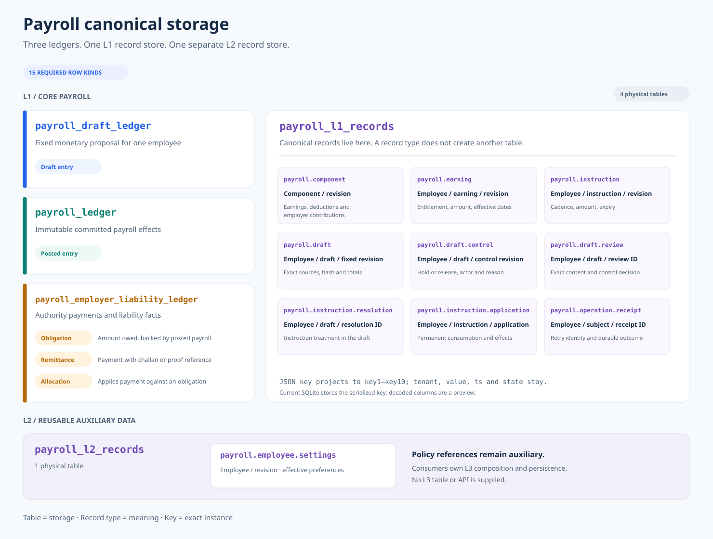
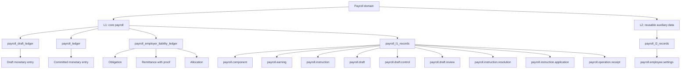
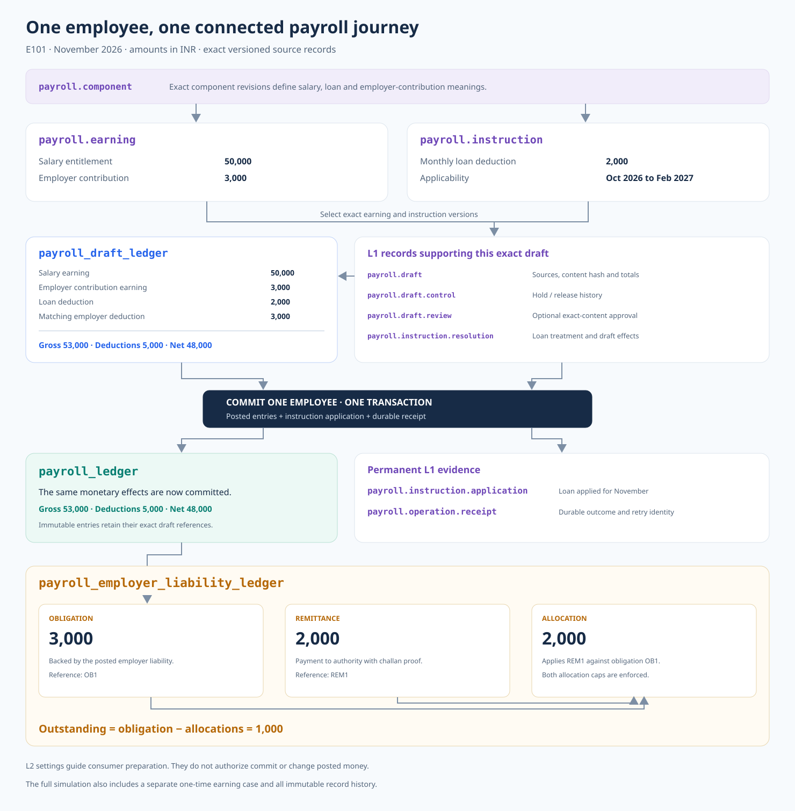
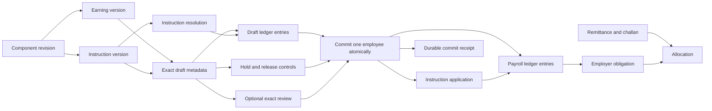

# Payroll canonical row mind map

The complete simulation model has **three canonical ledger tables**, **one L1
record table**, and **one separate L2 record table**. Software supplies no L3
persistence. Each box below is a meaning; only the named tables are storage.

## Storage map

[Open standalone SVG: Canonical storage map](../diagrams/payroll-canonical-storage.svg)

Mermaid source

That is **15 required row kinds**: nine L1 record types, one L2 record type,
one draft-entry kind, one posted-entry kind and three employer-liability kinds.
Different component directions, source revisions and control states are variations
within these kinds; they do not create tables or additional canonical types.

## How an employee payroll connects

[Open standalone SVG: Employee payroll journey](../diagrams/payroll-employee-journey.svg)

Mermaid source

Commit writes the posted entries, application evidence and receipt together.
An instruction resolution describes draft treatment; only committed application
consumes the instruction. Reviews are optional; a hold prevents commit. Draft
content is fixed. A subsequent adjustment preserves the earlier posted facts.
L2 settings can guide consumer preparation; they do not authorize or prove commit.

## Every canonical record type

All record keys follow `<type>:<subject>:<record>`. The table establishes the
layer, `tenant` establishes scope, and the key locates an immutable instance.
Numeric revisions sort numerically. Use the shared encoder for literal colon or
backslash in opaque IDs. `state` describes availability, not domain commit state.

| Type | Store | Subject / instance | Required meaning and references |
|---|---|---|---|
| `payroll.component` | L1 | Component / revision | Stable code/kind/country identity and display label; identifies earning, deduction or employer contribution |
| `payroll.earning` | L1 | Earning / revision | Employee, exact component version, minor-unit amount and effective bounds |
| `payroll.instruction` | L1 | Instruction / revision | Stable instruction ID, opaque version ID, employee, exact component, amount, cadence and inclusive expiry |
| `payroll.draft` | L1 | Draft / fixed revision | Employee/month, exact selected source versions, content hash, gross/deductions/net |
| `payroll.draft.control` | L1 | Exact draft / control revision | Complete held/cancelled state, actor and reason; preserves prior revisions |
| `payroll.draft.review` | L1 | Exact draft / review ID | Decision bound to draft content hash and control revision |
| `payroll.instruction.resolution` | L1 | Exact draft / resolution ID | Instruction version, treatment and draft-entry effects |
| `payroll.instruction.application` | L1 | Instruction version / application ID | Stable consumption identity, employee/month, draft and posted-entry effects |
| `payroll.operation.receipt` | L1 | Operation subject / receipt ID | Operation, actor, retry identity/hash, before/after and durable outcome |
| `payroll.employee.settings` | L2 | Employee / revision | Effective preferences and an explicitly external reusable-policy reference |

The exact stored field names and complete examples are in the executable
catalogue. These are explicit simulation contracts, not a production migration
or approval of unrelated organizational policy.

## Every canonical ledger entry kind

| Owning ledger | Entry kind | What the row establishes |
|---|---|---|
| `payroll_draft_ledger` | Draft entry | One fixed monetary effect referencing exact draft/source/component versions |
| `payroll_ledger` | Posted entry | One immutable committed monetary effect tied to the employee/month and originating draft |
| `payroll_employer_liability_ledger` | Obligation | Amount owed to an authority, backed by an exact posted liability entry |
| `payroll_employer_liability_ledger` | Remittance | Money passed to an authority and its challan/proof reference |
| `payroll_employer_liability_ledger` | Allocation | Amount of one remittance applied to one obligation |

An earning adds to gross; a deduction adds to deductions. Employer contribution
produces equal gross and deduction effects. Outstanding liability is obligation
minus allocations. A payment can be partially allocated or span obligations,
without counting the remittance itself as another liability reduction.

## Connected example

E101's November 2026 simulation starts from explicit versioned salary and employer
contribution records. Its monthly loan instruction expires after February 2027.

| Fact | Amount |
|---|---:|
| Salary earning | INR 50,000 |
| Employer contribution earning and matching deduction | INR 3,000 |
| Monthly loan deduction | INR 2,000 |
| Gross | INR 53,000 |
| Total deductions | INR 5,000 |
| Net | INR 48,000 |
| Employer obligation after posting | INR 3,000 |
| Challan-backed remittance and allocation | INR 2,000 |
| Remaining employer liability | INR 1,000 |

The same journey includes settings, source definitions, hold/release history,
review, resolutions, committed applications and operation receipts. A separate
one-time earning fixture demonstrates one-time consumption across versions.
Employee and actor IDs refer to external HR/auth subjects. The L2 policy reference
is opaque; this simulation does not invent a policy catalogue or upstream intake.

## Query and integrity map

| Access or guarantee | Canonical dimensions |
|---|---|
| Exact lookup | Store + tenant + canonical key |
| Definition/source history | Tenant + type + subject + numeric revision |
| Applicable earnings/instructions | Tenant + employee + effective/applicability bounds, with authoritative revision selection |
| Exact instruction version | Tenant + opaque version ID, uniquely associated with one stable instruction/revision |
| Draft and posted payroll | Tenant + employee + payroll month; preserve distinct payroll/draft identities |
| Instruction consumption | Tenant + stable instruction ID + employee; monthly scope also includes payroll month |
| Operation replay | Tenant + operation + actor + subject + retry identity |
| Employer outstanding/allocation caps | Tenant + obligation/remittance identity + entry kind |

Exact-key foreign references, type-specific validation and transactional checks
preserve integrity when parents move into L1 records. The simulation records
actual query plans; a canonical key shape alone is not an index or a performance
claim. No unrestricted L1 writes or cross-employee commit transaction is provided.

## Prior storage folded into this map

| Former storage | Current home |
|---|---|
| Instruction identities + instruction versions | `payroll.instruction` records |
| Calculation identities + calculation revisions | `payroll.draft` records |
| Draft entries | `payroll_draft_ledger` |
| Posted entries | `payroll_ledger` |
| Obligations + remittances + allocations | Typed entries in `payroll_employer_liability_ledger` |
| Component definitions + versions | `payroll.component` records |
| Draft controls + control events | Complete `payroll.draft.control` revisions |
| Exact candidate reviews | `payroll.draft.review` records |
| Resolutions + resolution links | `payroll.instruction.resolution` records with draft effects |
| Applications + application effects | `payroll.instruction.application` records with posted effects |
| Overlapping operation/evidence tables | `payroll.operation.receipt`, where they describe the same operation |

The executable report retains all 16 supporting-role dispositions. Exact HTTP
response replay remains an explicit transport gap; a domain receipt is not full
HTTP transport evidence. PostgreSQL authority, migration and load proof remain
separate from the complete row-kind catalogue for this simulation.
