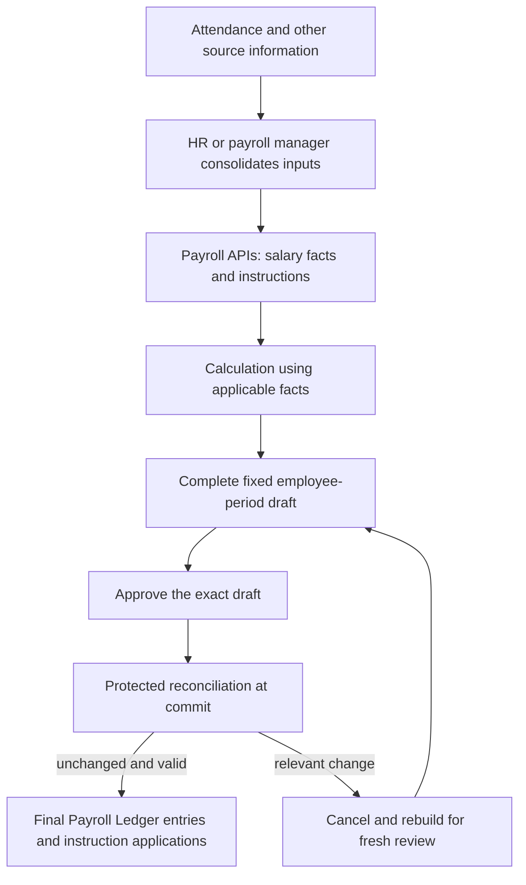

# HRMS Payroll Handbook — working edition

## Pinned goal and intended outcome

Established: 2026-09-05. The user requested a payroll handbook following the
permission-scope handbook approach, directed us to understand ground realities
first, and asked to pin the overall goal and outcome.

Current direction (PAY-PROCESS-004): begin with the concepts already expressed
in code—salary earnings, monthly and one-time instructions, the draft ledger,
and the Payroll Ledger. Understand and confirm their relationships, then refine
them. The earlier interpretation that an employer interview must precede core
concept work is superseded; see the [decision history](decision-log.md).

PAY-PROCESS-006 adds the discussion order: cover high-impact boundaries across
the model first, then return to detailed mechanics. The
[horizontal coverage map](handbook-roadmap.md#horizontal-coverage-map) records
the sequence and parked questions. PAY-PROCESS-008 clarifies that this breadth
must first close the high-impact core semantics; see the
[core-concept coverage checkpoint](core-coverage.md).

**Overall goal:** Develop a shared understanding of HRMS payroll, grounded in
actual operations, and turn that understanding into a handbook that guides
product design, implementation, and review.

Develop the handbook through focused discussion. Preserve reasoning, examples,
decisions, alternatives, and unresolved questions as the understanding evolves.
This charter sets the direction; it does not settle individual payroll rules.

## What the handbook should explain

| Area | Intended coverage |
|---|---|
| Operating reality | Who does what, where information comes from, deadlines, manual work, and common exceptions. |
| Core concepts | Salary entitlement, payroll inputs, calculations, approvals, monetary records, payments, and supporting evidence. |
| Complete journeys | Employee joining, monthly payroll, salary changes, corrections, exit settlement, statutory obligations, and year-end work. |
| Responsibilities and controls | What employees, HR, payroll, finance, software, and external services each own. |
| Expected behavior | What happens when information is missing, changes arrive late, approvals are withdrawn, or payments fail. |

Jurisdictions, employer types, workforce types, and the actual operating process
still need to be established. Inclusion here is a topic to investigate, not a
claim that the lab supports it or that one rule applies to every employer.

## Concrete outcome

A coherent working HRMS Payroll Handbook in this repository, supported by:

- Workflow diagrams showing people, inputs, decisions, records, and handoffs.
- Worked examples and counterexamples, including exceptions and corrections.
- A decision log preserving rationale, alternatives, and agreement status.
- A discussion roadmap with open questions, dependencies, and return points.
- An implementation gap register relating agreed requirements to verified
  software behavior.

## Completion criteria

We can walk through representative payroll scenarios and explain the inputs,
responsible people, decisions, resulting records, and exception handling without
relying on hidden assumptions. Terminology, rules, diagrams, and examples agree.
Remaining questions are explicitly deferred or tracked with their implications.
Implementation gaps are visible rather than presented as delivered behavior.

The handbook is not complete merely because these files exist or the ordinary
monthly payroll example is documented.

## Working sequence

1. Reconstruct the existing core model from code: identify the ledgers,
   instructions, operations, and relationships that produce the payroll flow.
2. Confirm and refine concepts: explain each boundary and lifecycle, test it
   with examples, and distinguish intended semantics from demo shortcuts.
3. Trace the resulting workflows and exceptions: preparation, drafting,
   approval, posting, correction, payslips, liabilities, and downstream outputs.
4. Agree rules and responsibilities: preserve rationale and alternatives;
   examine operational details when needed to settle a core concept.
5. Reconcile and publish: align chapters, examples, code evidence, open
   questions, and the implementation gap register.

Documentation grows through these stages; reconciliation does not require
waiting until the end to inspect source evidence.

## Evidence and decision discipline

Keep observed operating practice, verified repository behavior, illustrative
examples, proposed requirements, and agreed decisions distinguishable. Record
the repository revision for implementation findings. Code inspection alone
does not establish deployed behavior or an employer's operating process.

Existing lab behavior is evidence to examine. Proposed rules become agreements
through discussion; silence does not constitute agreement. Retain superseded
reasoning as labeled history. Statutory claims require applicable jurisdiction,
period, and authoritative sources when that branch is examined.

Creating this handbook does not itself authorize payroll implementation changes.

## Reading path

Start with the five ledgers below, then follow one monthly payroll through
preparation, commit, and a subsequent-month adjustment. The agreed model is
written as handbook content; its discussion history remains in the
[decision log](decision-log.md) and linked rationale chapters.

[The incorporation record](incorporation-record.md) identifies which material
came from agreements and which came from clearly described code. This edition
incorporates established material; it does not approve pending proposals.

## The five ledgers

**Status: agreed concepts**, based on PAY-CORE-001 through 005 and later
clarifications. Detailed definitions and alternatives are in
[core concepts](core-concepts.md#the-five-central-stores).

| Ledger | What it records | How it contributes to payroll |
|---|---|---|
| Salary Earning Ledger | Employee salary entitlement, broken into earning components | Supplies the applicable salary facts to calculation |
| Monthly standing-instruction ledger | Recurring earning or deduction directions, with an effective lifetime and expiry | Contributes in eligible payroll months; one ordinary committed application per employee/month |
| One-time instruction ledger | A direction intended for a single payroll application | Remains available until applied by a commit; retains its consumption record |
| Draft ledger | A complete, fixed monetary proposal for an employee and payroll period | Holds the amounts to review and approve before posting |
| Payroll Ledger | The committed earning and deduction entries | Records the final result; subsequent corrections affect a later month's payroll |

Salary entitlement and a committed salary earning are different records. The
first describes what calculation can use; the second is the resulting amount
recorded for a particular payroll. Similarly, monthly versus one-time describes
an instruction's recurrence, while earning versus deduction describes its
monetary effect. Both instruction types can produce either effect.

**Why the separation exists:** salary entitlement and temporary payroll
directions have different business meanings. A finite loan recovery can be a
monthly deduction instruction without changing salary entitlement or making
loan servicing part of payroll core. Draft and committed entries then separate
what is proposed from what has become final.

## From manager inputs to generated payroll

**Status: agreed flow.** PAY-INTAKE-001 establishes the manager handoff;
PAY-ARCH-001/002/003 and PAY-CORE-006-C establish the responsibility, unit of
work, authority, and commit boundaries.

The manager submits consolidated inputs through payroll APIs. The source-to-
manager delivery mechanism is not prescribed. Information being present in
attendance does not itself mean that it has entered payroll.

Calculation uses the applicable facts for the period when payroll runs. The
producing layer determines whether business inputs represent additional money,
replacement intent, or a duplicate request. Payroll does not infer those
relationships from equal amounts or matching component names. This is separate
from preventing repeated application of the same instruction.

Calculation logic produces business amounts. Payroll core accepts the proposed
entries through its governed lifecycle. A calculator cannot bypass approval or
commit controls. Mandatory tracing of each monetary entry back to its upstream
sources is outside the agreed core scope.

A complete draft fixes the employee-period proposal. Sources remain immutable
historical records: changes expire old records and create replacements. Source
maintenance can continue while a draft is reviewed. Before posting, protected
reconciliation checks that the applicable basis and instruction availability
still permit the reviewed result. Relevant changes require rebuilding and
fresh review. Validation, posting, and application recording are protected
together; the exact mechanism remains an implementation choice.

**Why:** reviewed amounts remain stable without a day-long source freeze. Payroll
can accept maintained facts while preventing a stale draft from being posted.
See [source reconciliation](source-reconciliation.md) for the full rationale.

## Instruction lifetime and application

**Status: agreed rules**, PAY-CORE-002 through 005, with PAY-CORE-009's
applicable-facts clarification.

| Situation | Established outcome |
|---|---|
| A preview is prepared or a draft is reviewed | No instruction is consumed merely by preparation or review |
| An uncommitted draft is abandoned | Its one-time instructions remain available, subject to current applicability |
| Payroll applying a one-time instruction commits | Record consumption with the committed result; another ordinary payroll cannot apply that instruction again |
| Payroll applying a monthly instruction commits | Record that employee/month's application; later eligible months remain available until expiry |
| An instruction covers September through January and January payroll runs in February | January can still use its eligible application, subject to other controls; February does not acquire an application outside the instruction's lifetime |

The user's five-month loan example is accommodated by a finite monthly
instruction. The core respects its expiry; the producing layer determines the
loan arrangement. A five-calendar-month schedule and five successful recoveries
can differ if payroll is skipped. Automatic extension or catch-up was not
adopted and is not implied by this example.

## One monthly payroll, then a correction

**Status: illustration of agreed rules**, PAY-CORE-001/003/004/011. These amounts
illustrate ledger behavior, not recommended payroll formulas.

| September component | Amount (INR) |
|---|---:|
| Salary earning | 50,000.00 |
| Monthly allowance | 1,500.00 |
| One-time bonus | 5,000.00 |
| Monthly deduction | -1,000.00 |
| Gross | 56,500.00 |
| Total deductions | 1,000.00 |
| Net | 55,500.00 |

The fixed draft contains the proposed components. Once approved and committed,
those amounts form September's generated payroll. The bonus is consumed and
the monthly instructions have their September applications recorded.

Generated/committed payroll is **as good as paid for payroll-core finality**.
The original result remains unchanged. If the bonus later requires INR 500
recovery, the producing layer supplies an adjustment for a subsequent payroll
month. For example, October's payroll includes INR -500 through October's
governed draft and commit flow. September still records its INR 5,000 bonus.

This rule concerns generated/committed payroll. A preview or uncommitted draft
remains a proposal. There is no additional employee-payment state to wait for
before the core treats committed payroll as final. The adjustment does not
reopen the original payroll or automatically restore a consumed instruction.

**Why:** subsequent-month adjustments preserve a stable historical result.
The [correction rationale](core-coverage.md#pay-core-011--generated-payroll-is-final-adjust-a-subsequent-month)
records the user's clarification and distinguishes it from the demo shortcut.

## Ownership, batches, and authority

**Status: agreed boundaries**, PAY-ARCH-002/003.

Each draft describes one employee's payroll for one period within the relevant
employer/tenant context. The manager operates under authority; preparing payroll
does not make the manager the ledger owner. Ownership here describes whose
payroll is recorded, rather than automatically granting access to the employee.

A batch coordinates exact employee drafts and retains each outcome. If 99
employee drafts pass reconciliation and one is stale, the 99 may commit while
the remaining draft is rebuilt and reviewed. Batch status must reflect that
partial completion. Replacement drafts do not inherit approval merely by being
members of the same batch.

Input maintenance, preparation, draft approval, and commit are distinct scoped
capabilities. Policy determines which a person or role may hold. Accepting an
instruction does not approve the entire payroll, and commit authority cannot
bypass reconciliation or exact-draft approval. No requirement for four separate
people has been adopted.

See [ownership and batch rationale](ledger-ownership.md) and
[authority rationale](authority-and-review.md) for examples and alternatives.

## Employer liabilities belong in payroll

**Status: user-clarified boundary**, PAY-ARCH-004. The five ledgers above describe
employee payroll. The employer-liability register also belongs within payroll,
recording the employer side of applicable payroll obligations and settlement.
General accounting is outside payroll and consumes the relevant information.

**Liability lifecycle — PAY-CORE-012:** the register tracks what the employer
owes. When the employer remits money to the government authority, the remittance
is recorded with proof such as the challan number, and the corresponding
liability closes. The history remains available. For example, an INR 1,000 TDS
liability is settled by the recorded INR 1,000 remittance and challan reference.
See the [liability lifecycle and rationale](payroll-outputs.md#pay-core-012--liability-remittance-proof-and-closure).

The TDS part of the register supports Form 16 deduction/deposit reporting.
Complete Form 16 also uses annual salary/tax information and official processed
statement/certificate records. See the [verified relationship and rationale](payroll-outputs.md#form-16-a-supporting-basis-not-the-only-basis).
This supports payroll ownership of the register; an internal balance alone is
not the complete issued certificate. Employee payroll remains final while
employer obligations are reconciled.

## What the existing lab additionally describes

**Status: inspected code behavior, not new agreed requirements.** The following
material is clearly described in lab revision
`737465d5e27888518018e9b1f28f75fcfcac0139`, [main.ts](../src/main.ts).
It is incorporated as evidence so the reader need not rediscover the demo.

| Existing concept | What the lab does | Limit of this description |
|---|---|---|
| Preparation preview | Produces a query ID, rows, and checksum; reviewing the preview changes local workflow state | The preview has no payroll business reference and is not a committed result or canonical draft approval |
| Component/head | Identifies an earning or deduction; demo producers supply signed amounts, and totals aggregate them | Demo sign/rounding and formula choices are not a complete adopted calculation policy |
| Proof attachment | Stores a file; simulated HR acceptance can produce an instruction | The attachment itself is not a monetary entry; actual evidence evaluation is not demonstrated |
| Payroll reference | Groups a draft and its posted entries under one payroll reference | Upstream source-reference fields in the demo are not mandatory core tracing requirements |
| Payslip snapshot and PDF | Records posted entry IDs and totals for a payroll reference; renders them as a PDF | This describes the lab's snapshot representation; it does not select a production format or delivery mechanism |
| Employer-liability records | Creates legal-entity-owned credits from tagged deductions and separate simulated settlement/match records | Ownership inside payroll is now clarified under PAY-ARCH-004; the demo does not verify settlement integration |
| Annual readiness package | Builds a package explicitly marked incomplete, using available payroll/liability records | It does not demonstrate completed annual issuance or establish applicable legal rules |

The [operating baseline](operating-baseline.md) contains the source revision,
full demo arithmetic, and limitations. The lab's mutable open drafts, weak
validation, missing expiry/application enforcement, direct-posting correction,
and absent actor authorization are documented in the
[implementation gap register](implementation-gaps.md). No implementation change
is implied by incorporating these descriptions.

---

## Decisions still requiring discussion

**PAY-Q-014 is answered with a corrected boundary:** the employer-liability
register is inside payroll; accounting is outside. Its Form 16 contribution and
the distinction from complete issuance are recorded in the
[output chapter](payroll-outputs.md). Detailed register and annual workflows
remain later work, rather than an unresolved ownership question.

**PAY-Q-009 / PAY-CORE-007 remains parked:** whether complete draft creation
should include sealing rather than exposing a separate seal operation.

Exact expiry representation, exceptional recovery policies, API and concurrency
mechanics, detailed role assignments, and wider journeys remain in the
[roadmap](handbook-roadmap.md). They are not silently selected by the ordinary
examples. The rejected overlap-detection and mandatory-source-tracing questions,
and the settled subsequent-month correction rule, are not open questions.

## Resume here

This edition has incorporated agreed concepts and clearly described lab
behavior into the reading path above. Review [what was incorporated](incorporation-record.md)
against the prior discussion snapshot before continuing new decisions.
The incorporation originally left PAY-Q-014 open. The subsequent user
clarification now settles employer-register/accounting ownership; the handbook
is still a working edition with wider scenarios and implementation gaps.
