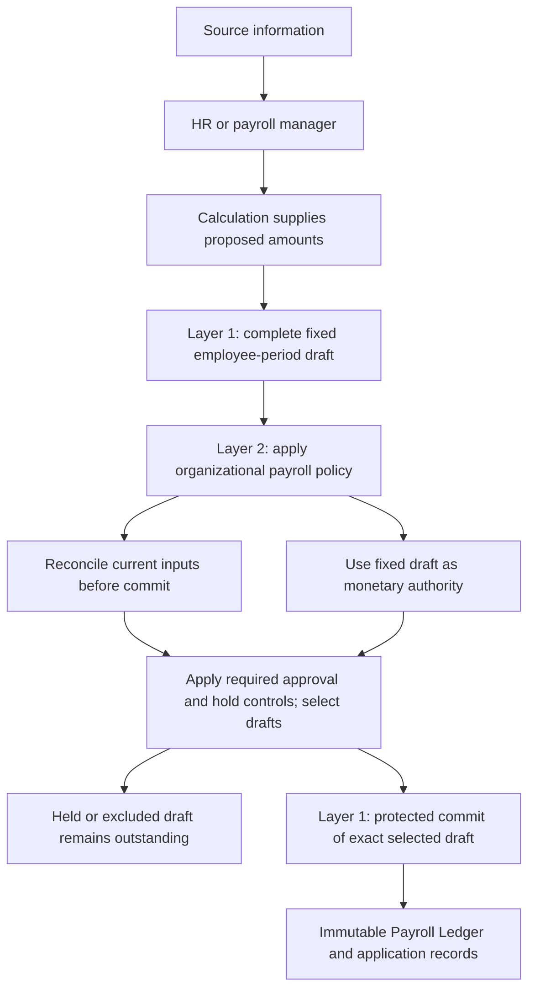

# HRMS Payroll Handbook — working edition

## Pinned goal and intended outcome

Established: 2026-09-05. The user requested a payroll handbook following the
permission-scope handbook approach, directed us to understand ground realities
first, and asked to pin the overall goal and outcome.

Current direction (PAY-PROCESS-004): begin with the concepts already expressed
in code—salary earnings, monthly and one-time instructions, the draft ledger,
and the Payroll Ledger. Understand and confirm their relationships, then refine
them. The earlier interpretation that an employer interview must precede core
concept work is superseded; see the [decision history](decision-log.md).

PAY-PROCESS-006 adds the discussion order: cover high-impact boundaries across
the model first, then return to detailed mechanics. The
[horizontal coverage map](handbook-roadmap.md#horizontal-coverage-map) records
the sequence and parked questions. PAY-PROCESS-008 clarifies that this breadth
must first close the high-impact core semantics; see the
[core-concept coverage checkpoint](core-coverage.md).

**Overall goal:** Develop a shared understanding of HRMS payroll, grounded in
actual operations, and turn that understanding into a handbook that guides
product design, implementation, and review.

Develop the handbook through focused discussion. Preserve reasoning, examples,
decisions, alternatives, and unresolved questions as the understanding evolves.
This charter sets the direction; it does not settle individual payroll rules.

## What the handbook should explain

| Area | Intended coverage |
|---|---|
| Operating reality | Who does what, where information comes from, deadlines, manual work, and common exceptions. |
| Core concepts | Salary entitlement, payroll inputs, calculations, approvals, monetary records, payments, and supporting evidence. |
| Complete journeys | Employee joining, monthly payroll, salary changes, corrections, exit settlement, statutory obligations, and year-end work. |
| Responsibilities and controls | What employees, HR, payroll, finance, software, and external services each own. |
| Expected behavior | What happens when information is missing, changes arrive late, approvals are withdrawn, or payments fail. |

Jurisdictions, employer types, workforce types, and the actual operating process
still need to be established. Inclusion here is a topic to investigate, not a
claim that the lab supports it or that one rule applies to every employer.

## Concrete outcome

A coherent working HRMS Payroll Handbook in this repository, supported by:

- Workflow diagrams showing people, inputs, decisions, records, and handoffs.
- Worked examples and counterexamples, including exceptions and corrections.
- A decision log preserving rationale, alternatives, and agreement status.
- A discussion roadmap with open questions, dependencies, and return points.
- An implementation gap register relating agreed requirements to verified
  software behavior.

## Completion criteria

We can walk through representative payroll scenarios and explain the inputs,
responsible people, decisions, resulting records, and exception handling without
relying on hidden assumptions. Terminology, rules, diagrams, and examples agree.
Remaining questions are explicitly deferred or tracked with their implications.
Implementation gaps are visible rather than presented as delivered behavior.

The handbook is not complete merely because these files exist or the ordinary
monthly payroll example is documented.

## Working sequence

1. Reconstruct the existing core model from code: identify the ledgers,
   instructions, operations, and relationships that produce the payroll flow.
2. Confirm and refine concepts: explain each boundary and lifecycle, test it
   with examples, and distinguish intended semantics from demo shortcuts.
3. Trace the resulting workflows and exceptions: preparation, drafting,
   approval, posting, correction, payslips, liabilities, and downstream outputs.
4. Agree rules and responsibilities: preserve rationale and alternatives;
   examine operational details when needed to settle a core concept.
5. Reconcile and publish: align chapters, examples, code evidence, open
   questions, and the implementation gap register.

Documentation grows through these stages; reconciliation does not require
waiting until the end to inspect source evidence.

## Evidence and decision discipline

Keep observed operating practice, verified repository behavior, illustrative
examples, proposed requirements, and agreed decisions distinguishable. Record
the repository revision for implementation findings. Code inspection alone
does not establish deployed behavior or an employer's operating process.

Existing lab behavior is evidence to examine. Proposed rules become agreements
through discussion; silence does not constitute agreement. Retain superseded
reasoning as labeled history. Statutory claims require applicable jurisdiction,
period, and authoritative sources when that branch is examined.

Creating this handbook does not itself authorize payroll implementation changes.

## Reading path

**Current: layered conceptual handbook, reviewed under PAY-ARCH-006.**
PAY-Q-020 is closed as superseded. Implementation remains paused; completing
this documentation does not authorize code changes or release.

Read the handbook in this order:

1. [Layer-1 payroll records and contracts](layer-1-contracts.md): the five
   employee stores, exact drafts, authority, posting, history and liabilities.
2. [HRMS payroll policy](hrms-payroll-policy.md): manager intake, approval,
   holds, reconciliation or draft authority, batch selection and worked outcomes.
3. [Operation contracts](payroll-operation-contracts.md) and
   [lifecycle](payroll-lifecycle.md): capabilities and the two policy paths.
4. [Annual package](annual-payroll-package.md), scenarios and supporting chapters:
   downstream information and the scope of each example.
5. [Review record](handbook-review.md#current-consolidated-review) and
   [baseline reconciliation](baseline-reconciliation.md): conceptual coverage,
   current Core evidence, local candidate and deferred work.

The [decision log](decision-log.md) and [boundary rationale](payroll-policy-boundary.md)
preserve why organizational workflow is separate from stable ledger guarantees.
The [core-concepts chapter](core-concepts.md) retains source reconstruction and
historical alternatives. Its demo behavior is not the production contract.

## The five ledgers

**Status: agreed concepts**, based on PAY-CORE-001 through 005 and later
clarifications. Detailed definitions and alternatives are in
[core concepts](core-concepts.md#the-five-central-stores).

| Ledger | What it records | How it contributes to payroll |
|---|---|---|
| Salary Earning Ledger | Employee salary entitlement, broken into earning components | Supplies the applicable salary facts to calculation |
| Monthly standing-instruction ledger | Recurring earning or deduction directions, with an effective lifetime and expiry | Contributes in eligible payroll months; one ordinary committed application per employee/month |
| One-time instruction ledger | A direction intended for a single payroll application | Remains available until applied by a commit; retains its consumption record |
| Draft ledger | A complete, fixed monetary proposal for an employee and payroll period | Holds the amounts to review and approve before posting |
| Payroll Ledger | The committed earning and deduction entries | Records the final result; subsequent corrections affect a later month's payroll |

Salary entitlement and a committed salary earning are different records. The
first describes what calculation can use; the second is the resulting amount
recorded for a particular payroll. Similarly, monthly versus one-time describes
an instruction's recurrence, while earning versus deduction describes its
monetary effect. Both instruction types can produce either effect.

**Why the separation exists:** salary entitlement and temporary payroll
directions have different business meanings. A finite loan recovery can be a
monthly deduction instruction without changing salary entitlement or making
loan servicing part of payroll core. Draft and committed entries then separate
what is proposed from what has become final.

## From manager inputs to generated payroll

In the supplied operating account, information reaches the HR/payroll manager,
who consolidates it through APIs. Business calculation supplies proposed amounts.
Layer 1 creates a complete fixed draft and provides the protected operations
that the organization's Layer-2 policy uses.

A current-source change blocks an otherwise unchanged draft under policy A;
it need not do so under policy B. Neither can silently change the draft's
money, bypass applicable controls, duplicate posting or rewrite history.
The [policy chapter](hrms-payroll-policy.md) works through both outcomes and a
held employee in a batch.

Layer 1 may record approval and hold separately. Policy determines who uses
them and what releasing a hold requires. The distinction concerns records and
responsibilities, not a mandated field name or particular implementation.

## Instruction lifetime and application

**Status: agreed rules**, PAY-CORE-002 through 005, with PAY-CORE-009's
applicable-facts clarification.

| Situation | Established outcome |
|---|---|
| A preview is prepared or a draft is reviewed | No instruction is consumed merely by preparation or review |
| An uncommitted draft is abandoned | Its one-time instructions remain available, subject to current applicability |
| Payroll applying a one-time instruction commits | Record consumption with the committed result; another ordinary payroll cannot apply that instruction again |
| Payroll applying a monthly instruction commits | Record that employee/month's application; later eligible months remain available until expiry |
| An instruction covers September through January and January payroll runs in February | January can still use its eligible application, subject to other controls; February does not acquire an application outside the instruction's lifetime |

The user's five-month loan example is accommodated by a finite monthly
instruction. The core respects its expiry; the producing layer determines the
loan arrangement. A five-calendar-month schedule and five successful recoveries
can differ if payroll is skipped. Automatic extension or catch-up was not
adopted and is not implied by this example.

## One monthly payroll, then a correction

This example uses the handbook’s approval-and-reconciliation policy. The
[draft-authoritative variant](hrms-payroll-policy.md#policy-b-the-fixed-draft-is-monetary-authority)
is also valid; both preserve exact posted amounts and application guarantees.

**Status: illustration of agreed rules**, PAY-CORE-001/003/004/011. These amounts
illustrate ledger behavior, not recommended payroll formulas.

| September component | Amount (INR) |
|---|---:|
| Salary earning | 50,000.00 |
| Monthly allowance | 1,500.00 |
| One-time bonus | 5,000.00 |
| Monthly deduction | -1,000.00 |
| Gross | 56,500.00 |
| Total deductions | 1,000.00 |
| Net | 55,500.00 |

The fixed draft contains the proposed components. Once approved and committed,
those amounts form September's generated payroll. The bonus is consumed and
the monthly instructions have their September applications recorded.

Generated/committed payroll is **as good as paid for payroll-core finality**.
The original result remains unchanged. If the bonus later requires INR 500
recovery, the producing layer supplies an adjustment for a subsequent payroll
month. For example, October's payroll includes INR -500 through October's
governed draft and commit flow. September still records its INR 5,000 bonus.

PAY-CORE-013 supplies the after-exit scope boundary: a later correction for a
former employee is handled in external accounting, not subsequent-month payroll.

This rule concerns generated/committed payroll. A preview or uncommitted draft
remains a proposal. There is no additional employee-payment state to wait for
before the core treats committed payroll as final. The adjustment does not
reopen the original payroll or automatically restore a consumed instruction.

**Why:** subsequent-month adjustments preserve a stable historical result.
The [correction rationale](core-coverage.md#pay-core-011--generated-payroll-is-final-adjust-a-subsequent-month)
records the user's clarification and distinguishes it from the demo shortcut.

## Applying the model across scenarios

The [scenario chapter](payroll-scenarios.md) applies existing agreements to salary
changes, expiry, late processing, abandoned/stale drafts, batch exceptions,
subsequent-month corrections, and government-liability settlement. It includes
a three-month worked example and distinguishes pre-commit validation from
liability reconciliation. A separate section describes the lab’s grouped
challan behavior as code evidence only.

For a single continuous example, follow the [end-to-end payroll and liability
walkthrough](payroll-scenarios.md#end-to-end-payroll-and-liability-walkthrough).
Its seven payroll components produce INR 57,500 gross, INR 4,000 deductions,
and INR 53,500 net, followed by the corresponding employer liabilities and
remittances with proof. It includes the CTC contribution earning/deduction pair
and keeps later corrections and annual use within the established boundaries.

## Joining, partial periods, exit, and annual work

The [extended journeys](employee-and-annual-journeys.md) apply the established
flow to a first payroll, supplied partial-month amounts, and exit-related
components. Business calculations supply the amounts; the same draft,
applicable policy and core commit guarantees govern them. These examples do not
select proration formulas or settlement entitlement rules.

The annual workflow combines committed employee payroll, the employer-liability
register and remittance proof, annual tax information, and applicable official
records. The chapter separates this data flow from the lab's incomplete annual
readiness generator.

PAY-Q-015 is resolved by PAY-CORE-013: corrections after employee exit belong
in external accounting, outside payroll. They do not create a later adjustment
payroll or change the former employee’s generated payroll.

## Ownership, batches, and authority

**Status: agreed boundaries**, PAY-ARCH-002/003.

Each draft describes one employee's payroll for one period within the relevant
employer/tenant context. The manager operates under authority; preparing payroll
does not make the manager the ledger owner. Ownership here describes whose
payroll is recorded, rather than automatically granting access to the employee.

**Employee-month association — PAY-CORE-015:** all payroll for one employee and
month is tied together. Its identifier expresses that association; no canonical
format or method for generating it is established. Individual draft and entry
IDs serve their own purposes. Rebuilding a draft does not transfer approval
merely because it belongs to the same employee-month payroll. See the
[association rationale](ledger-ownership.md#pay-core-015--all-payroll-for-an-employee-and-month-is-tied-together).

A batch coordinates exact employee drafts and retains each outcome. Under
policy A, if 99
employee drafts pass reconciliation and one is stale, the 99 may commit while
the remaining draft is rebuilt and reviewed. Batch status must reflect that
partial completion. Replacement drafts do not inherit approval merely by being
members of the same batch.

Input maintenance, preparation, draft approval, and commit are distinct scoped
capabilities. Policy determines which a person or role may hold. Accepting an
instruction does not approve the entire payroll, and commit authority cannot
bypass active holds, required approval or the selected freshness controls. No requirement for four separate
people has been adopted.

See [ownership and batch rationale](ledger-ownership.md) and
[authority rationale](authority-and-review.md) for examples and alternatives.

## Employer liabilities belong in payroll

**Status: user-clarified boundary**, PAY-ARCH-004. The five ledgers above describe
employee payroll. The employer-liability register also belongs within payroll,
recording the employer side of applicable payroll obligations and settlement.
General accounting is outside payroll and consumes the relevant information.

**Liability lifecycle — PAY-CORE-012:** the register tracks what the employer
owes. When the employer remits money to the government authority, the remittance
is recorded with proof such as the challan number, and the corresponding
liability closes. The history remains available. For example, an INR 1,000 TDS
liability is settled by the recorded INR 1,000 remittance and challan reference.
See the [liability lifecycle and rationale](payroll-outputs.md#pay-core-012--liability-remittance-proof-and-closure).

The TDS part of the register supports Form 16 deduction/deposit reporting.
Complete Form 16 also uses annual salary/tax information and official processed
statement/certificate records. See the [verified relationship and rationale](payroll-outputs.md#form-16-a-supporting-basis-not-the-only-basis).
This supports payroll ownership of the register; an internal balance alone is
not the complete issued certificate. Employee payroll remains final while
employer obligations are reconciled.

## Employer contribution in CTC

**Status: user-confirmed flow**, PAY-CORE-014. The employer contribution named
in the offer-letter CTC enters payroll as an earning and a matching deduction.
Both are included in the governed draft and committed Payroll Ledger. The
corresponding obligation then enters the employer-liability register.

For example, INR 50,000 other earnings plus an INR 1,000 employer-contribution
earning give INR 51,000 gross. The matching INR 1,000 deduction leaves net at
INR 50,000. The employer register records the INR 1,000 obligation, which closes
when the corresponding remittance and proof are recorded.

The contribution therefore increases gross and deductions equally; it does not
change net. This uses the existing ledger flow rather than bypassing payroll.
See the [full example and rationale](payroll-outputs.md#pay-core-014--employer-contributions-through-payroll).

## Annual preparation and reconciliation

PAY-Q-018 / PAY-ARCH-005 establishes the scope: the [payroll annual package](annual-payroll-package.md)
and its issuance handoff belong in this handbook. Detailed statutory issuance
procedures are a separate chapter for the applicable jurisdiction and year.

The [reporting and reconciliation chapter](reporting-and-reconciliation.md)
explains four distinct results: finalized employee payroll, settled employer
liability, a prepared annual package, and an issued certificate. It traces the
annual information and shows why matching totals alone do not establish correct
employee/year coverage or complete issuance.

The liability example uses a supplied allocation of one remittance across two
obligations. Automatic allocation remains unspecified. PAY-CORE-016 establishes
that partial remittance leaves the unpaid balance outstanding until settled;
see [the worked balances](payroll-outputs.md#pay-core-016--partial-remittance-leaves-the-unpaid-liability-outstanding).
The annual example is illustrative data, not a tax formula. Source limitations
are separately recorded as PAY-GAP-007/008.

## What the existing lab additionally describes

**Status: inspected code behavior, not new agreed requirements.** The following
material is clearly described in lab revision
`737465d5e27888518018e9b1f28f75fcfcac0139`, [main.ts](../src/main.ts).
It is incorporated as evidence so the reader need not rediscover the demo.

| Existing concept | What the lab does | Limit of this description |
|---|---|---|
| Preparation preview | Produces a query ID, rows, and checksum; reviewing the preview changes local workflow state | The preview has no payroll business reference and is not a committed result or canonical draft approval |
| Component/head | Identifies an earning or deduction; demo producers supply signed amounts, and totals aggregate them | Demo sign/rounding and formula choices are not a complete adopted calculation policy |
| Proof attachment | Stores a file; simulated HR acceptance can produce an instruction | The attachment itself is not a monetary entry; actual evidence evaluation is not demonstrated |
| Payroll reference | Groups a draft and its posted entries under one payroll reference | Upstream source-reference fields in the demo are not mandatory core tracing requirements |
| Payslip snapshot and PDF | Records posted entry IDs and totals for a payroll reference; renders them as a PDF | This describes the lab's snapshot representation; it does not select a production format or delivery mechanism |
| Employer-liability records | Creates legal-entity-owned credits from tagged deductions and separate simulated settlement/match records | Ownership inside payroll is now clarified under PAY-ARCH-004; the demo does not verify settlement integration |
| Annual readiness package | Builds a package explicitly marked incomplete, using available payroll/liability records | It does not demonstrate completed annual issuance or establish applicable legal rules |

The [operating baseline](operating-baseline.md) contains the source revision,
full demo arithmetic, and limitations. The lab's mutable open drafts, weak
validation, missing expiry/application enforcement, direct-posting correction,
and absent actor authorization are documented in the
[implementation gap register](implementation-gaps.md). No implementation change
is implied by incorporating these descriptions.

---

## Policy choices and deferred work

PAY-Q-020 is closed as superseded: withdrawal, hold/release and source-freshness
choices belong in the organization's [HRMS payroll policy](hrms-payroll-policy.md).
They are not unresolved universal Layer-1 rules. Organizations choose their
policy without weakening exact-money, authorization or history guarantees.

The employee-month association, finite instruction lifetime, monthly/one-time
application meaning, employer-liability ownership, contribution treatment and
annual package scope remain explained with their retained decisions. This pass
does not reopen them or invent a canonical identifier generator.

Employer calendars, concrete approver assignments, exceptional repayment rules,
automatic remittance allocation and statutory issuance are explicitly deferred.
Storage, API design and concurrency mechanisms are implementation work. None
should be presented as an unanswered foundational question without a concrete
change to the Layer-1 contract.

## Resume here

The layered conceptual edition is documented and reviewed. See the
[current review](handbook-review.md#current-consolidated-review) for the checked
scenarios and limits. PAY-Q-020 is closed as superseded; no organizational
freshness or withdrawal choice is silently imposed on every deployment.

Implementation remains paused. Future work must compare the accepted Layer-1
contracts and the selected organizational policy with current Core main. The
[database review](database-table-review.md) and [baseline reconciliation](baseline-reconciliation.md)
keep the unmerged local fixes, existing API limitations and remaining CLI/live
proof separate from handbook completion.
