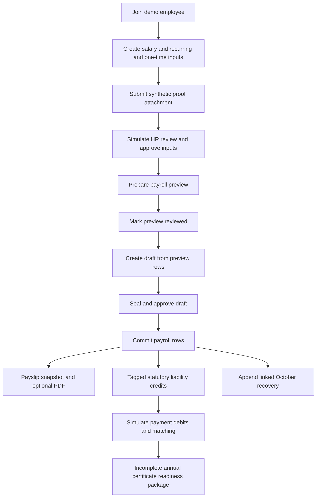

# Payroll operating baseline — evidence and unknowns

Status: initial source review, 2026-09-05. This is supporting material for the
[working handbook](handbook.md), not an agreed payroll operating model.

## Evidence boundary

The lab was inspected at `737465d5e27888518018e9b1f28f75fcfcac0139`.
The local HRMS Core checkout was inspected at
`13621844165b31346facc53c4b45bbd8d9437816`; it was behind its locally recorded
`origin/main` by seven commits. These findings concern those source revisions,
not the latest upstream release or a running deployment. No payroll execution,
bank transaction, or employer process was observed in this review.

The lab's INR, PF, TDS, and Form 16 examples suggest an Indian example context.
They do not establish the jurisdiction or workforce scope of this handbook.
Amounts, formulas, and certificate requirements below describe the demo code;
they have not been assessed as applicable statutory rules.

## Existing lab journey

The diagram traces the guided demo functions in [main.ts](../src/main.ts).
The role labels are simulated workflow descriptions, not authenticated actors.

Employee salary disbursement is not a step in this guided flow. The simulated
payments at `L` concern statutory liabilities. Posting payroll and producing a
payslip therefore do not demonstrate that the employee received money.

## PAY-EX-001 — numbers in the guided example

Source: `createDemoPayroll`, `approveDemoInputs`, and `preparePayrollReport` in
[main.ts](../src/main.ts). The amounts below are derived from those functions,
not a recorded payroll run or a recommended salary calculation.

| Component | Demo amount (INR) | Source in the demo |
|---|---:|---|
| Basic | 50,000.00 | Salary entry |
| HRA | 20,000.00 | Salary entry |
| Special allowance | 10,000.00 | Salary entry |
| Internet allowance | 1,500.00 | Recurring input |
| Bonus | 5,000.00 | One-time input |
| PF deduction | 6,000.00 | Hardcoded demo formula using basic |
| VPF deduction | 1,000.00 | Recurring input |
| Unpaid leave deduction | 2,000.00 | One-time input with a fixed amount |
| Income tax deduction | 4,500.00 | Fixed recurring instruction created during simulated proof review |

The arithmetic gives gross earnings of INR 86,500.00, deductions of
INR 13,500.00, and net of INR 73,000.00. The proof is an attachment; its contents
are not interpreted to calculate tax. The demo's later correction appends an
INR 500.00 recovery under an October reference linked to the original bonus.

This provides useful distinctions to discuss: salary versus monthly changes,
evidence versus an instruction, and a preview versus posted money. It does not
settle the definitions or rules for the handbook.

## Source findings and their limits

| ID | Observed source behavior | Limit on the conclusion |
|---|---|---|
| PAY-EV-001 | `submitProofAttachment` stores a file; `approveDemoInputs` accepts it, creates a fixed tax instruction, and approves all inputs. | No actual proof examination or independent reviewer authorization is demonstrated. |
| PAY-EV-002 | `preparePayrollReport` produces preview rows; `fireDraftPayroll` copies them into a draft and compares checksums. | The producer is fixed to the demo employee and month. This is not evidence of complete employee selection, proration, or effective-date resolution. |
| PAY-EV-003 | `sealDraft`, `approveDraft`, and `commitDraft` require successive statuses. | The guided UI combines seal and approval. Status checks do not demonstrate separation between people, durable transactions, or concurrent approval safety. |
| PAY-EV-004 | `commitDraft` records `consumedBy` for referenced one-time inputs. | `appendDraft` and `commitDraft` do not reject another draft using the same source reference. A consumption marker alone does not prove prevention of duplicate use. |
| PAY-EV-005 | `carryAdjustmentToNextMonth` appends a linked recovery and leaves original posted rows intact. | It directly commits the correction without the ordinary draft approval path. Its date parameter is not checked to ensure a later month. This is a demo path, not an agreed correction policy. |
| PAY-EV-006 | `payAndReconcileChallans` creates debit entries, generated reference strings, and matches to deduction credits. | These are simulated records; the function neither initiates a bank transfer nor verifies a bank or authority response. |
| PAY-EV-007 | `createForm16` creates a package whose status is `incomplete` and lists missing inputs. | A readiness document is not evidence that a valid annual certificate has been issued. Applicable issuance rules require a separate sourced review. |

All seven findings refer to [the inspected lab source](https://github.com/agentlabs-poc/agentlabs-payroll-ledger-lab/blob/737465d5e27888518018e9b1f28f75fcfcac0139/src/main.ts).

## HRMS Core comparison

The inspected Core source distinguishes finalized payroll from payment.
`GetBankAdvice` requires a completed or paid run and identifies exceptions such
as missing beneficiary details and non-positive net amounts.
`MarkRunPaid` accepts a payment reference and a payment-manifest hash and checks
them against the run's payment evidence. These are source-level controls, not
proof of bank settlement verification.
Sources: [bank advice](https://github.com/agentlabs-poc/agentlabs-hrms-core/blob/13621844165b31346facc53c4b45bbd8d9437816/internal/modules/payroll/bank_advice.go),
[payment acknowledgement](https://github.com/agentlabs-poc/agentlabs-hrms-core/blob/13621844165b31346facc53c4b45bbd8d9437816/internal/modules/payroll/ledger_service.go).

Full-and-final generation returns a pipeline-not-configured error for a valid
employee ID in this revision. The legacy compute handler also explicitly
reports an unavailable calculation pipeline. Neither observation establishes
the status of every other calculation path.
Sources: [settlement](https://github.com/agentlabs-poc/agentlabs-hrms-core/blob/13621844165b31346facc53c4b45bbd8d9437816/internal/modules/payroll/settlement.go),
[legacy compute handler](https://github.com/agentlabs-poc/agentlabs-hrms-core/blob/13621844165b31346facc53c4b45bbd8d9437816/internal/modules/payroll/run_lifecycle_handler.go).

## User-confirmed operating account

After the initial source review, the user answered PAY-Q-001: source information,
potentially including attendance, goes to an HR/payroll manager. The manager
consolidates inputs and submits them into payroll through APIs, with a role
normally supporting that responsibility. The user explicitly described no
automatic internal source-service transition into payroll. See
[PAY-INTAKE-001 and its worked handoff](payroll-input-flow.md).

This is a user-supplied operating fact, not a conclusion inferred from the demo.
The source findings above retain their original revision and evidence limits.

## Original operating inventory and later scope clarifications

| Area | Missing operating evidence |
|---|---|
| Employer and workforce | Jurisdictions, legal entities, workforce categories, pay frequencies, and the assignment of HR/payroll-manager responsibilities. |
| Monthly intake | How source information reaches the manager; who validates it; what the manager submits through payroll APIs. |
| Calendar | Period boundaries, cutoffs, approval dates, payment dates, and handling of late information. |
| Review | Who prepares, checks, approves, releases payments, and investigates discrepancies. |
| Exceptions | Actual examples of joins, exits, retroactive changes, attendance corrections, missing details, and failed payments. |
| Closing the cycle | What proves employee payment, authority settlement, accounting handoff, and completion. |

This inventory records the initial investigation, not a list of still-unanswered
core questions. Subsequent decisions establish the manager handoff, scoped
capabilities, payroll finality, employer-liability closure, and the after-exit
accounting boundary. In particular, proof of employee bank receipt is not a new
payroll-finality gate (PAY-CORE-011); government-liability closure uses remittance
proof (PAY-CORE-012). Detailed payloads and external operating policies are later
context rather than prerequisites for the agreed model.

Current direction (PAY-PROCESS-004) is to start with the [core concepts](core-concepts.md)
and the flow they already produce. **PAY-Q-002** was withdrawn from the current
sequence. The operating unknowns above are retained for later investigation;
they do not block understanding and refining the existing conceptual model.
