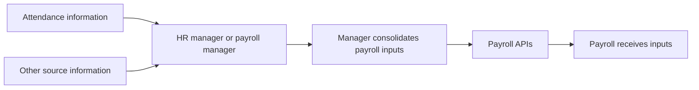

# Payroll inputs — sources and manager handoff

Status: initial operating account supplied by the user under **PAY-Q-001**.
This chapter records that account and its implications. Endpoint mappings and
deployed behavior have not yet been verified against it.

## PAY-INTAKE-001 — manager consolidates inputs into payroll

Payroll inputs come through APIs from an HR manager or payroll manager. A role
will normally support that responsibility; its name and exact permissions are
not settled here.

Information originates in other sources, potentially including attendance.
It goes to the manager, who consolidates it into payroll. The described flow
does not automatically transition information internally from the source
service into payroll.

The arrows describe the business handoff. They do not prescribe screens,
network calls, file formats, or a manual copy-and-paste process. Source-to-manager
delivery could itself use software; that mechanism has not been described.

## What this establishes

The source provides information, while the manager supplies inputs to payroll.
For an attendance example, an attendance record does not by itself demonstrate
that payroll has received an input. The manager's consolidation and submission
are part of the operating flow.

This distinction matters when explaining missing or late information: we need
to establish whether it exists at the source, has reached the manager, or has
been submitted to payroll. Those are explanatory checkpoints, not newly agreed
database statuses.

The account names HR manager and payroll manager as possible responsibilities.
It does not require two different people or a two-person approval sequence.
Submitting an input has not been equated with approving a payroll calculation
or releasing a payment.

## PAY-EX-002 — attendance handoff

Illustrative case for discussion: attendance reports two unpaid days for an
employee. Following the stated flow, that information reaches the HR/payroll
manager, who consolidates the relevant payroll input and submits it through
the payroll APIs.

What the submitted input contains remains open. It might carry the number of
days, a monetary deduction, or another representation. PAY-ARCH-001 subsequently
places business amount calculation in higher-order logic, and PAY-ARCH-003
distinguishes input acceptance from draft approval. Exact payload and role
assignment remain open; these responsibility boundaries are settled.

Counterexample to the stated flow: an attendance service automatically creates
a payroll deduction without the manager handoff. That would omit the manager's
consolidation step. This comparison does not establish a blanket prohibition on
all service integration or decide whether any future automation may act under
manager authority.

## Next question and remaining dependencies

**PAY-Q-002 — withdrawn from the current sequence:** For the attendance example,
what exactly does the manager submit to payroll, and what does payroll then do
with that input? The user identified this question as premature and directed us
to begin with the [existing core concepts](core-concepts.md) (PAY-PROCESS-004).

Keep the following open as the operating account develops:

- How information reaches the manager and how conflicting source information
  is handled.
- The submitted input's meaning, supporting evidence, and conversion into money.
- The manager role's permissions and any separate review or approval.
- Cutoffs, resubmissions, corrections, and handling of late source changes.
- Which APIs implement the handoff and how their actual behavior compares with
  the operating account.

Return to the [roadmap](handbook-roadmap.md) for the current core-concept review.
These operational details remain available for later investigation when needed.
