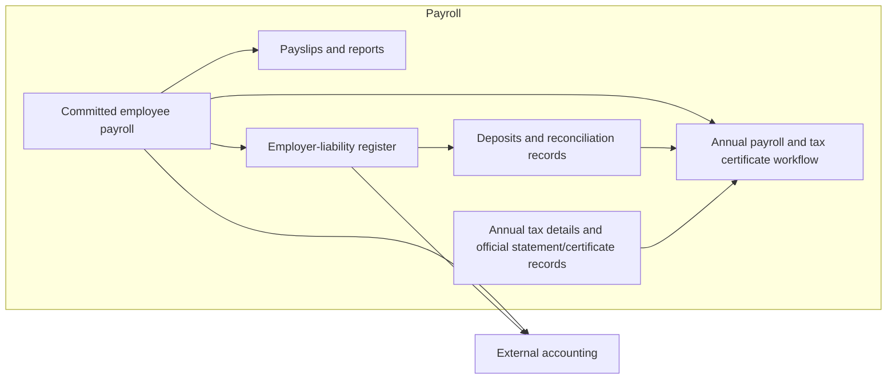
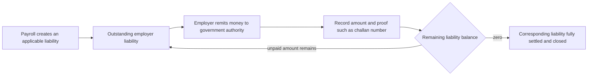
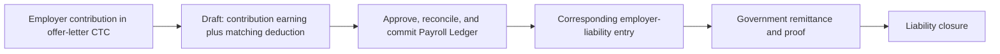

# Payroll outputs, employer liabilities, and external accounting

**PAY-ARCH-004 / PAY-Q-014 — ownership clarified by the user.** Accounting is
outside payroll; the employer-liability register is inside payroll. This
corrects the assistant's earlier grouping of liability management with external
accounting. Detailed interfaces and statutory calculation rules are not selected.

## Responsibility boundary

| Area | Place in the model | Purpose |
|---|---|---|
| Employee payroll ledgers | Inside payroll | Salary facts/instructions, fixed drafts, and final committed employee amounts |
| Payslips and payroll reports | Payroll outputs; existing lab behavior | Present and summarize the recorded payroll result |
| Employer-liability register | Inside payroll; employer/legal-entity side | Record payroll-related obligations, deposits/settlements, and reconciliation |
| Annual payroll certificate workflow | Payroll compliance output | Combine the applicable payroll/tax data and statutory records for issuance |
| General accounting | Outside payroll | Consume payroll and liability information for its own accounting records |

The five central stores describe the employee payroll flow. They are not an
exhaustive inventory of the payroll module: the employer-liability register
adds the employer side within payroll. A distinct ledger and owner do not
imply an external system or a separate deployment.

Generated employee payroll remains final under PAY-CORE-011. Employer-liability
settlement has its own events within payroll and does not reopen employee
amounts. Source tracing is still not a mandatory core responsibility under
PAY-CORE-010; connecting statutory records to employees/periods serves the
liability and reporting task rather than tracing upstream business origins.

The diagram is a responsibility/data map. It does not select APIs, transport,
or automatic production of an official certificate from ledger balances alone.

## Why the employer register belongs in payroll

The user explicitly placed this register inside payroll and identified its
connection to Form 16. The register retains the employer's payroll obligations
and how deposits relate to them. Keeping that information with payroll supports
employee/period reconciliation and annual reporting while accounting maintains
its broader books independently.

For example, payroll records an employee TDS deduction of INR 1,000. The
employee result is final. The employer register records the corresponding TDS
obligation, and the relevant deposit/allocation records record its settlement.
The payroll certificate workflow can use those records alongside annual salary
and tax data. General accounting consumes the relevant information externally.

This explains the boundary; it does not assert a specific tax formula, filing
schedule, or verified bank/authority integration.

## PAY-CORE-012 — liability, remittance proof, and closure

**User-confirmed lifecycle.** The employer-liability register tracks the
outstanding obligation. When the employer remits the money to the government
authority, payroll records that remittance and its proof, such as the challan
number, against the corresponding liability. The remitted amount is settled;
any unpaid balance remains a liability under PAY-CORE-016. Full closure occurs
when the remaining balance is settled. Obligation and settlement history remain available.

Example: an outstanding TDS liability is INR 1,000. The employer remits
INR 1,000 and records the challan reference against that liability. Its
outstanding balance becomes zero, with the deposit evidence retained. Generating
employee payroll alone does not close this government liability.

Rationale: the register explains both what is owed and how it was discharged.
It supports reconciliation and the deduction/deposit information needed for
statutory reporting. Recording a remittance does not alter the earlier
employee payroll result. Exact allocation of one challan across employees or
periods and proof-validation interfaces remain later details. PAY-CORE-016
below settles the basic partial-remittance balance behavior.

## PAY-CORE-016 — partial remittance leaves the unpaid liability outstanding

**Agreed under PAY-Q-017.** The user approved recording the settled portion and
confirmed that the unpaid remainder stays a liability.

| Event | Original obligation (INR) | Cumulative settled amount (INR) | Outstanding liability (INR) |
|---|---:|---:|---:|
| Payroll records the obligation | 10,000 | 0 | 10,000 |
| Employer remits 6,000 with corresponding proof | 10,000 | 6,000 | 4,000 |
| Employer remits the remaining 4,000 with corresponding proof | 10,000 | 10,000 | 0 |

After the first remittance, the liability is partly settled and remains open
for INR 4,000. After the second, it is fully settled and closed. Preserve both
remittance/proof records and the original obligation; employee payroll remains
final throughout. These are explanatory balances, not prescribed status codes.

Rationale: the register must show what was actually remitted and what is still
owed. Recording a partial payment cannot close the unpaid portion. Waiting until
full settlement to recognize any settled amount was the unselected alternative.

The example uses supplied corresponding remittances. It does not select an
automatic allocation order, excess-deposit treatment, or statutory payment policy.
GAP-007 remains open for implementation and allocation/proof-interface details.

## Form 16: a supporting basis, not the only basis

Verified against official Income Tax Department Form 16 material on 2026-09-05.
The cited form is under the Income-tax Act, 1961; this is an explanation of the
Form 16 relationship discussed in the lab, not selection of the form/version
applicable to every payroll period.

Part A includes employee-level tax deduction/deposit details and quarterly
statement references. Part B includes salary, exemptions/deductions, and tax
computation. The TDS portion of the employer-liability register can support the
first group; annual payroll and tax data support the second. A register covering
other payroll obligations is broader than Form 16's salary-TDS purpose.
[Official Form 16](https://www.incometaxindia.gov.in/documents/d/guest/103120000000007849-pdf).

The Department's tutorial describes obtaining Form 16 through TRACES after the
TDS statement is processed. Consequently, the internal register is supporting
data and a reconciliation basis; its balance alone is not an official issued
certificate. [Income Tax Department tutorial](https://incometaxindia.gov.in/Tutorials/48.Form-16-and-16A.pdf).

The allocation of those inputs to our modules is an architectural inference
from the form's information needs and the user's stated payroll boundary.
Detailed annual input completeness, filing/version applicability, and issuance
integration remain later work.

## Existing code evidence

Lab revision `737465d5e27888518018e9b1f28f75fcfcac0139`,
[main.ts](../src/main.ts): `createPayslipSnapshot`, `createStatutoryLiabilities`,
`matchReconciliation`, and `createForm16`.

The lab creates employee payslip snapshots from committed entries. It also
creates legal-entity-owned liability credits from tagged deductions, with
separate simulated settlement/match records. Its annual readiness routine uses
both salary totals and TDS/liability data and explicitly produces an incomplete
package. This supports the clarified module shape; it does not demonstrate a
complete certificate-issuance implementation.

## PAY-CORE-014 — employer contributions through payroll

**User-confirmed clarification under PAY-Q-016.** The employer contribution
mentioned in the offer-letter CTC first enters payroll as an earning and a
matching deduction. The committed Payroll Ledger precedes the corresponding
entry in the employer-liability register. It is not a direct-to-liability
amount that bypasses employee payroll.

The earning increases gross. The matching deduction increases total deductions
by the same amount, leaving net unchanged. The deduction represents the amount
that goes toward the employer obligation instead of employee take-home pay.

Illustrative payroll with no other components:

| Payroll component or total | Amount (INR) |
|---|---:|
| Other salary earnings | 50,000 |
| Employer contribution earning | 1,000 |
| Gross | 51,000 |
| Matching employer contribution deduction | -1,000 |
| Total deductions | 1,000 |
| Net | 50,000 |
| Corresponding employer liability | 1,000 |

The paired entries use the existing earning/deduction model and governed payroll
flow. They represent one contribution and one corresponding obligation, not two
liabilities simply because two payroll rows exist. After remittance with proof,
the corresponding liability closes under PAY-CORE-012.

Rationale: the payroll result presents the contribution included in the CTC
while distinguishing gross earnings from cash paid to the employee. The
employer register then tracks the obligation arising from that committed result.
No extra ledger primitive or payroll-bypass path is needed for this concept.

Gross here is the handbook's payroll total. Tax treatment and statutory-report
classification remain responsibilities of the applicable calculation/reporting
rules; inclusion in gross does not silently select those rules.

**Code comparison:** the lab supports earning and deduction heads and derives
liabilities from tagged committed deductions. That shape can represent this
flow. It does not contain a complete employer-contribution earning/deduction
example or enforce its business calculation/pairing. Production conformance
must not be inferred solely from the generic primitives.

**PAY-Q-016 — answered by correcting the premise.** The assistant had proposed
an employer-only amount that would leave both gross and net unchanged and might
enter the liability register directly. The user clarified the existing CTC
model: contribution earning plus matching deduction, payroll first, liability
second. Gross increases; net is balanced by the deduction. The earlier proposal
is withdrawn. Exact head configuration, calculation, and commit coupling remain
implementation details, not reopened scope questions.

## Decision history and remaining work

The earlier PAY-Q-014 proposal grouped employer-liability and accounting
processes as downstream consumers and the assistant described both as outside
core payroll. The user corrected that boundary: employer liabilities belong
inside payroll, while accounting is outside. PAY-ARCH-004 now records that
clarification rather than the earlier proposal.

The user's tentative Form 16 connection was checked against official material
above. It is supported as a partial data basis, not as a claim that a liability
register alone generates the complete certificate. There is no need to ask the
ownership question again. Subsequent agreements specify partial settlement
(PAY-CORE-016) and the annual package/handoff (PAY-ARCH-005). Supplied allocation
balances and annual completeness checks are recorded in the
[operation contracts](payroll-operation-contracts.md). Record formats and proof
integration remain engineering work; automatic allocation and external accounting
policy are not selected by these rules.
